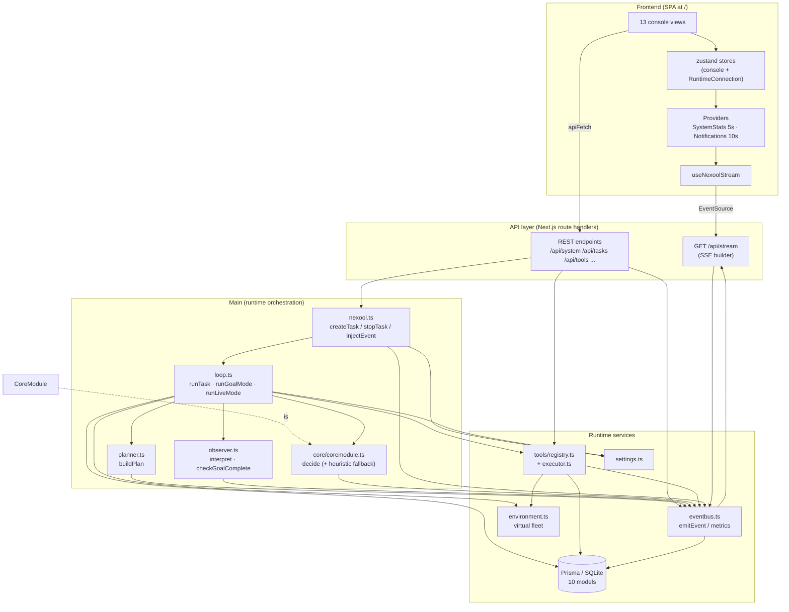

# Architecture

NexTool Q1 is a single Next.js 16 process that hosts both the operations console (a
client-side SPA) and the task-processing runtime (server modules under
`src/lib/nexool/`). There is no separate worker: tasks run in-process, state survives
via SQLite (Prisma) and `globalThis` singletons.

## Full stack at a glance

| Layer | Location | Responsibility |
| --- | --- | --- |
| Console SPA (React 19) | `src/components/console/**`, `src/hooks`, `src/lib/nexool/client.ts` | 13 views, zustand stores, SSE subscription, polling providers. |
| REST API (App Router) | `src/app/api/**/route.ts` | 30 endpoints, all returning `ApiEnvelope`. |
| SSE stream | `src/app/api/stream/route.ts` + `src/lib/nexool/stream/sse.ts` | Realtime event push with replay. |
| Main orchestrator | `src/lib/nexool/main/{nexool,loop,planner,observer}.ts` | Task lifecycle for Goal + Live Mode. |
| CoreModule (AI decision) | `src/lib/nexool/core/{coremodule,heuristic}.ts` | Tool matching + parameter generation. |
| Tool runtime | `src/lib/nexool/tools/**` | Registry, async executor, 15 built-in tools. |
| Event manager | `src/lib/nexool/eventbus.ts` | Emit/persist/broadcast every event; runtime metrics. |
| State & data | `prisma/schema.prisma`, `src/lib/db.ts`, `environment.ts`, `settings.ts` | Tasks, events, tools, memory, history, settings, live state. |

## Component diagram

The decision path inside Main is exactly the spec loop:
**UNDERSTAND → PLAN → SELECT TOOL → GENERATE PARAMS → EXECUTE → OBSERVE →
UPDATE STATE → REPLAN → COMPLETE**, implemented in `runGoalMode`/`runLiveMode`.

## Data flow, end to end

1. **Create** — the console (or any client) posts to `POST /api/tasks`. `nexool.createTask`
   validates + clamps config, writes a `queued` Task row, emits `task.created`, registers a
   `TaskRunHandle` (stop flag, AbortController, wake slot) in a globalThis map, and
   fire-and-forgets `runTask`.
2. **Plan** — `runTask` flips the row to `running`, loads enabled tool definitions from the
   registry, calls `buildPlan` (LLM, deterministic fallback), persists the refined goal and
   plan, emits `planner.plan`.
3. **Decide + execute** — each iteration assembles a context bundle (state summary, last
   observation, ≤5 memory entries, ≤5 history entries, fleet health), asks CoreModule for
   ONE structured decision (`tool_call | no_tool | clarification_required |
   cannot_execute | stop`), then executes the chosen tool through the executor with
   timeout + abort. Independent plan steps sharing a `parallelGroup` execute in parallel.
4. **Observe** — the Observer turns the raw `ToolExecution` into a concise operational
   sentence (`interpret`) and `checkGoalComplete` decides whether the goal is achieved
   (LLM verify with 6 s timeout; heuristic markers at reasoning level ≤ 2).
5. **Events everywhere** — every step emits typed events through the event bus, which
   persists them to `TaskEvent`, appends to an in-memory ring (500) and pushes them to all
   SSE subscribers. The console renders them live.
6. **Realtime + polling** — one shared SSE connection (15 min replay, 500-event cap)
   drives Events/Task Preview/Live Monitor; `/api/system` (5 s) and
   `/api/notifications` (10 s) polls drive the Dashboard and bell.

## Process model & persistence split

| Concern | Mechanism | Lifetime |
| --- | --- | --- |
| Task handles (stop flag, abort, wake) | `globalThis.__nextoolRuntime` map | Process |
| Event bus state, metrics, ring buffer | `globalThis.__nextoolBus` | Process (HMR-safe) |
| Virtual server fleet | `globalThis.__nextoolEnv` | Process |
| Tool handlers | `globalThis.__nextoolRegistry` map | Process (definitions in DB) |
| Tasks, events, history, memory, stats | SQLite via Prisma | Durable |
| Settings | SQLite row + 10 s memory cache | Durable |

This split is deliberate: anything the runtime acts on *right now* is in memory for speed;
anything that must survive restarts or feed the console history is in SQLite. After a
process restart, tasks previously `running`/`waiting` remain in the DB with their last
persisted state; the in-memory handles (and thus live scheduling) are gone.

## Design invariants

- **Not a chatbot** — the LLM is used only for structured decisions (plan JSON, CoreModule
  JSON, observer verdicts, subgoal proposals), never for free-form chat replies.
- **Honest states** — capabilities are reported truthfully: adapter booleans on
  `/api/models` come from real import probes (TF.js, Parquet), genuinely unavailable
  features are labeled unavailable (WebSocket transport, training pause/resume), and
  nothing is faked.
- **Envelope contract** — every REST endpoint returns
  `{ ok: true, data }` or `{ ok: false, error: { code, message } }`.
- **No throw across the tool boundary** — `executeTool` always resolves with a structured
  `ToolExecution`.
- **Explicit Live Mode** — `mode` is never auto-switched to `live`.

## Deep dives

- [Main](main.md) — orchestrator responsibilities, Goal vs Live.
- [Planner](planner.md) · [Observer](observer.md) · [CoreModule](../ai-core/core-module.md)
- [Events](events.md) — every event type and payload.
- [Scheduler](scheduler.md) · [Runtime](runtime.md) — lifecycle and limits.
