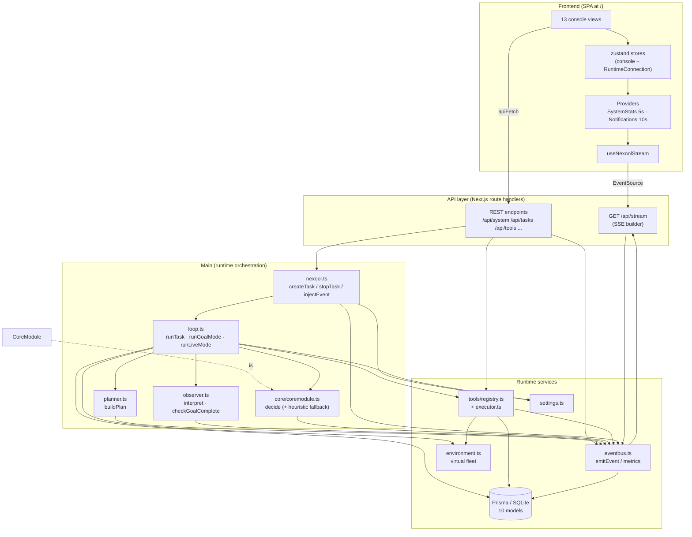

# Architecture

NexTool Q1 is a single Next.js 16 process that hosts both the operations console (a
client-side SPA) and the task-processing runtime (server modules under
`src/lib/nexool/`). There is no separate worker: tasks run in-process, state survives
via SQLite (Prisma) and `globalThis` singletons.

## Full stack at a glance

| Layer | Location | Responsibility |
| --- | --- | --- |
| Console SPA (React 19) | `src/components/console/**`, `src/hooks`, `src/lib/nexool/client.ts` | 20 views (incl. the v1.0.14 **Limitations** and **Assistant** pages), zustand stores, SSE subscription, polling providers. |
| REST API (App Router) | `src/app/api/**/route.ts` | 30+ endpoints, all returning `ApiEnvelope`. |
| SSE stream | `src/app/api/stream/route.ts` + `src/lib/nexool/stream/sse.ts` | Realtime event push with replay. |
| Main orchestrator | `src/lib/nexool/main/{nexool,loop,planner,observer}.ts` | Task lifecycle for Goal + Live Mode (v1.0.14: event-driven live scheduler). |
| CoreModule (AI decision) | `src/lib/nexool/core/{coremodule,heuristic}.ts` | Tool matching + parameter generation (`CONTEXT.trigger` since v1.0.14). |
| Tool runtime | `src/lib/nexool/tools/**` | Registry, async executor, 33 built-in tools (incl. v1.0.14 `ask.self`/`ask.user`). |
| Event manager | `src/lib/nexool/eventbus.ts` | Emit/persist/broadcast every event; runtime metrics; the `event.*` lifecycle emitter (`emitEventLifecycle`). |
| State & data | `prisma/schema.prisma`, `src/lib/db.ts`, `environment.ts`, `settings.ts` | Tasks, events, tools, memory, history, settings, live state. |

## Component diagram



The decision path inside Main is exactly the spec loop:
**UNDERSTAND → PLAN → SELECT TOOL → GENERATE PARAMS → EXECUTE → OBSERVE →
UPDATE STATE → REPLAN → COMPLETE**, implemented in `runGoalMode`/`runLiveMode`.

## The event-driven Live Mode state machine (v1.0.14)

Since v1.0.14 there is exactly **ONE scheduler** for every live task and it is
**event-driven**: `runLiveMode` (in `loop.ts`) owns the continuous lifecycle

```text
RUN → WAIT → EVENT or INTERVAL → OBSERVE → UNDERSTAND → ACT → FINISH → PROCESS QUEUED EVENTS → WAIT
```

- **Initial execution** — the first cycle runs on STARTUP (`trigger: 'initial'`), before
  the task ever parks in `waiting`; there is no first-interval wait.
- **Immediate event reaction** — `injectEvent` interrupts the wait the moment an event
  is admitted. The old priority ≤ 5 wake gate is REMOVED: ALL events are triggers,
  priority is ordering/metadata only.
- **Event admission pipeline** (one pass per injected event, all observable as
  `event.*` lifecycle events — see [Events](events.md#the-event-lifecycle-family-v1014)):

```text
injectEvent(type, payload, priority, source)
      │
      ▼
event.received ──► stop check ──(stopped)──► event.rejected("Task is stopped.")
      │
      ▼
queue-off (no Read & Act All Events) AND action running/pending AND not paused?
      │ yes                                                     │ no
      ▼                                                         ▼
event.rejected("Live action already running…")          event.admitted → handle.inbox
      (NO backlog — §2.2)                                       │
      │                                                         ▼
      │                                          wake ──► drainInbox
      │                                                ├─ queue mode: enqueueLiveEvent
      │                                                │    (16 KiB guard, cap task.eventQueueCap;
      │                                                │    full → lowest priority displaced →
      │                                                │    event.rejected with reason)
      │                                                │    → event.queued → drainEventQueue
      │                                                │      (one-by-one: priority asc, then seq;
      │                                                │       event.processing → completed/failed;
      │                                                │       no interval waits between events)
      │                                                └─ single-event: first event processed now,
      │                                                   extras rejected observably
      ▼
cycle: OBSERVE → UNDERSTAND → ACT → FINISH  (CONTEXT.trigger carries the FULL event;
interval triggers are message-less)
```

- **Stop is total (§31)** — stopping cancels inbox + queued events observably
  (`event.cancelled`); nothing runs after the stop. Failed event cycles never deadlock
  the queue (§32 — failure recorded, next event proceeds).

## Data flow, end to end

1. **Create** — the console (or any client) posts to `POST /api/tasks`. `nexool.createTask`
   validates + clamps config, writes a `queued` Task row, emits `task.created`, registers a
   `TaskRunHandle` (stop flag, AbortController, wake slot) in a globalThis map, and
   fire-and-forgets `runTask`.
2. **Plan** — `runTask` flips the row to `running`, loads enabled tool definitions from the
   registry, calls `buildPlan` (LLM, deterministic fallback), persists the refined goal and
   plan, emits `planner.plan`.
3. **Decide + execute** — each iteration assembles a context bundle (state summary, last
   observation, ≤5 memory entries, ≤5 history entries, fleet health), asks CoreModule for
   ONE structured decision (`tool_call | no_tool | clarification_required |
   cannot_execute | stop`), then executes the chosen tool through the executor with
   timeout + abort. Independent plan steps sharing a `parallelGroup` execute in parallel.
4. **Observe** — the Observer turns the raw `ToolExecution` into a concise operational
   sentence (`interpret`) and `checkGoalComplete` decides whether the goal is achieved
   (LLM verify with 6 s timeout; heuristic markers at reasoning level ≤ 2).
5. **Events everywhere** — every step emits typed events through the event bus, which
   persists them to `TaskEvent`, appends to an in-memory ring (500) and pushes them to all
   SSE subscribers. The console renders them live.
6. **Realtime + polling** — one shared SSE connection (15 min replay, 500-event cap)
   drives Events/Task Preview/Live Monitor; `/api/system` (5 s) and
   `/api/notifications` (10 s) polls drive the Dashboard and bell.

## Process model & persistence split

| Concern | Mechanism | Lifetime |
| --- | --- | --- |
| Task handles (stop flag, abort, wake) | `globalThis.__nextoolRuntime` map | Process |
| Event bus state, metrics, ring buffer | `globalThis.__nextoolBus` | Process (HMR-safe) |
| Virtual server fleet | `globalThis.__nextoolEnv` | Process |
| Tool handlers | `globalThis.__nextoolRegistry` map | Process (definitions in DB) |
| Tasks, events, history, memory, stats | SQLite via Prisma | Durable |
| Settings | SQLite row + 10 s memory cache | Durable |

This split is deliberate: anything the runtime acts on *right now* is in memory for speed;
anything that must survive restarts or feed the console history is in SQLite. After a
process restart, tasks previously `running`/`waiting` remain in the DB with their last
persisted state; the in-memory handles (and thus live scheduling) are gone.

## Design invariants

- **Not a chatbot** — the LLM is used only for structured decisions (plan JSON, CoreModule
  JSON, observer verdicts, subgoal proposals), never for free-form chat replies. (The
  v1.0.14 **Assistant** page is a conversation UX OVER the runtime: every user message
  becomes a `user.message` EVENT on a live task, and replies are humanized
  observations — the decision machinery underneath is unchanged.)
- **Honest states** — capabilities are reported truthfully: adapter booleans on
  `/api/models` come from real import probes (TF.js, Parquet), genuinely unavailable
  features are labeled unavailable (WebSocket transport, training pause/resume), and
  nothing is faked. `ask.user` returns `success: false` instead of fabricating an
  unanswered question.
- **Envelope contract** — every REST endpoint returns
  `{ ok: true, data }` or `{ ok: false, error: { code, message } }`.
- **No throw across the tool boundary** — `executeTool` always resolves with a structured
  `ToolExecution`.
- **Explicit Live Mode** — `mode` is never auto-switched to `live`.
- **Admission is observable (v1.0.14)** — every injected live event reports its
  lifecycle (`event.received/.admitted/.queued/.processing/.completed/.rejected/.failed/
  .cancelled`); the runtime never silently drops, queues or filters an event.

## Access boundaries (real fs ↔ VFS/ ↔ mcp/restricted)

v1.0.14 turns the VFS into a REAL directory (`VFS/` inside the project storage root,
§24) — the boundary table below is the authoritative capability map:

| Environment | Filesystem reach | Path language | Notes |
| --- | --- | --- | --- |
| `js-function` / `nodejs` (restricted) | **`VFS/` ONLY** — the shared sandboxed tree, via virtual absolute paths rooted at `/` | virtual paths (`/data/…`, `/workspace/…`); traversal/encoded/symlink escapes rejected (`VirtualFSAccessError`) | `require('fs')` is the sandbox fs; limits from `vfs.*` (runtime-editable via Limitations); virtual `child_process` runs virtual commands on this tree — never a host shell. |
| `freedom-node` (unrestricted, config-gated) | **REAL host fs** — and since v1.0.14 it can ALSO access the VFS tree because `VFS/` physically exists inside the runtime working directory | host paths (`fs.readFile('VFS/notes/x.txt')` works) | No path redirection, no VFS limits; the `fs.enabled`/`fs.restricted` configuration gate (fail closed `FREEDOM_DISABLED`) is the only control. |
| `mcp` connectors | **No direct filesystem access** — tool calls are mediated by the MCP connector layer (HTTP + configurable auth) | n/a | Stays VFS-less/restricted: a connector tool observes task context only; it never receives the host fs or the sandbox session. |
| Built-in `fs.*` tools | **`VFS/` only** (virtual paths) | virtual paths | `fs.download` exposes files through short-lived console URLs that re-verify the VFS boundary per request. |
| Runtime services (API routes, FS Inspector) | Real fs — READ-ONLY, realpath-confined to the runtime working directory | host paths | `GET /api/inspector/fs` (403 `FS_ACCESS` outside the root) and `GET /api/inspector/vfs` (the shared `VFS/`). |

The VFS one-time migration (legacy `data/vfs` → `VFS/`, logged `[vfs] v1.0.14
migration`) is described in [Tool Development → The Virtual File System](tool-development.md#the-virtual-file-system-v106).

## Deep dives

- [Main](main.md) — orchestrator responsibilities, Goal vs Live.
- [Planner](planner.md) · [Observer](observer.md) · [CoreModule](../ai-core/core-module.md)
- [Events](events.md) — every event type and payload (incl. the v1.0.14 `event.*` lifecycle family).
- [Scheduler](scheduler.md) · [Runtime](runtime.md) — lifecycle and limits.
- [Live Mode](live-mode.md) — the event-driven lifecycle in depth.
- [Frontend](frontend.md) — the console views, including the v1.0.14 **Limitations** and
  **Assistant** pages: the Assistant is the production chat experience (glassmorphism,
  the NexTool robot centerpiece with runtime-driven expressions, progress derived from
  REAL task events, humanized observations, inline interaction cards) — it renders
  conversation, never code/JSON internals; everything it shows comes from the same task
  runtime described above.
