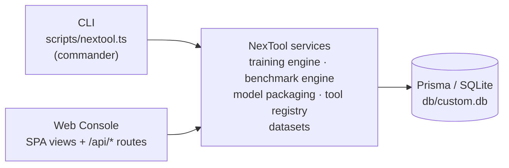

# CLI — `nextool`

v1.0.2 ships a command-line interface for the operations that previously required the
console or curl: training, benchmarking, model packaging, dataset management and tool
testing. Every command talks to the **same service layer** as the web console — there is
exactly one training engine, one benchmark engine and one packaging implementation
(`src/lib/nexool/training/*`), so a CLI-trained model and a console-trained model are
indistinguishable in the registry.



## Running the CLI

```bash
bun run cli -- <command>          # via the package script
bun scripts/nextool.ts <command>  # directly
```

`package.json` also declares `"bin": { "nextool": "./scripts/nextool.ts" }`, so after a
global/link install the `nextool` command is available. Examples below use the short
form. Every command and subcommand supports `--help`; `-V` / `--app-version` prints the
application version. Exit code is `0` on success, `1` on failure with a readable
`error: …` message.

Dataset/model references accept an **id** (cuid) or a **name** (newest match wins;
`--dataset-version` disambiguates). `model export -m current` resolves to the newest
exportable package (`tfjs-trained-classifier` / `tfjs-native-import`).

## `train` — train a tool-selection classifier

Real TensorFlow.js run (see [Training](../ai-core/training.md)). Creates a
`TrainingJobRecord`, runs it synchronously, prints the job log and registers the
checkpoint as a `ModelRecord`.

| Option | Values | Default |
| --- | --- | --- |
| `-d, --dataset <ref>` *(required)* | dataset id or name | — |
| `--dataset-version <version>` | disambiguate by version | newest |
| `-e, --epochs <n>` | 1–100 | 20 |
| `-b, --batch-size <n>` | 1–128 | 8 |
| `-l, --learning-rate <x>` | 0.0001–1 | 0.01 |
| `-v, --val-split <x>` | 0–0.5 | 0.2 |
| `--no-shuffle` | disable shuffling | shuffle on |
| `--early-stop <n>` | patience on `val_loss` (0 = off) | 0 |

```bash
nextool train -d tool-selection -e 20 --early-stop 5
```

Output: `> dataset:` / `> config:` lines, then the job log (`·` info, `!` warn, `x`
error) and finally `[ok] training completed — model "tc-…" registered (<id>)` with final
loss/accuracy and the export hint. Errors: dataset not found; *Not enough labeled
training data* (needs ≥ 4 examples and ≥ 2 distinct tools).

## `benchmark` — score a decision unit against a dataset

Runs the real decision unit per example (see [Benchmarks](../ai-core/benchmarks.md)).

| Option | Values | Default |
| --- | --- | --- |
| `-d, --dataset <ref>` *(required)* | dataset id or name | — |
| `--dataset-version <version>` | disambiguate by version | newest |
| `-m, --model <key>` | `llm-core`, `heuristic-fallback` or a trained model id | `heuristic-fallback` |
| `--limit <n>` | max cases | all labeled examples |
| `--timeout <ms>` | per-case timeout for `llm-core` | 30000 |
| `--label <text>` | label stored in the run history | — |

```bash
nextool benchmark -d tool-selection -m heuristic-fallback
nextool benchmark -d tool-selection -m llm-core --limit 20   # real LLM calls
```

Output: `[ok] benchmark completed (<id>) over N cases` with tool-selection accuracy,
schema validity, param accuracy (`-` + `(no expectedParams)` when null), no-tool rate,
avg/p95 latency and avg confidence. Errors: dataset not found / no labeled examples;
unknown model id; per-case failures roll into `BENCHMARK_FAILED`.

## `model` — package operations

| Command | Options | Does |
| --- | --- | --- |
| `model export` | `-m, --model <ref>` *(required, `current` = newest exportable)* · `-f, --format <tfjs\|nextool>` *(required)* · `-o, --output <path>` *(required)* | Writes the zip (native tfjs layout or `.nextool` package — see [Model Format](../ai-core/model-format.md)). Creates the output directory. Prints size in bytes. |
| `model import <file>` | file path | Registers a `.nextool` zip, native tfjs zip or bare JSON manifest. Prints format, id, architecture/params/tfjs line and any warnings (e.g. *bare manifest … not runnable*). |
| `model list` | `--json` | Lists id, name, version, format, status, note. |
| `model info <ref>` | — | Prints manifest highlights: architecture, parameterCount, datasetVersion, tfjsCompatibility, trainedAt, classes, vocabSize, finalMetrics, note. |

```bash
nextool model export -m current -f tfjs -o ./exports/model.zip
nextool model export -m current -f nextool -o ./exports/core.nextool
nextool model import ./exports/core.nextool
```

Only models whose manifest carries native TFJS topology + weights are exportable;
trying to export a bare `nextool-manifest` fails with an explicit error. Imports are
compatibility-checked (weights must actually load into TF.js) before registration.

## `dataset` — dataset operations

| Command | Options | Does |
| --- | --- | --- |
| `dataset import <file>` | `-n, --name` *(required)* · `-v, --version` *(required)* · `--note <text>` | Imports `{ name, version, examples[] }` or a bare examples array. Prints split counts (train/val/test/unsplit). |
| `dataset export <ref>` | `-o, --output <path>` (stdout when omitted) · `--dataset-version` | Writes the JSON export (same shape as the HTTP export). |
| `dataset list` | `--json` | id, name, version, format, split sizes. |
| `dataset info <ref>` | — | Split sizes, categories, note. |

```bash
nextool dataset import ds.json -n my-ds -v 1.0.0
nextool dataset export my-ds -o ./my-ds.json
```

**Parquet is rejected explicitly** — a `.parquet` file fails with *"Parquet import is
not supported by the current engine (JSON only) — the parquet adapter is not
installed."* The parquet adapter is genuinely not installed (see
[Datasets](../ai-core/datasets.md)).

## `tool` — registry operations

| Command | Options | Does |
| --- | --- | --- |
| `tool list` | `--json` | Enabled marker, name, environment, call count, avg ms. |
| `tool test <name>` | `-p, --params <json>` (default `{}`) | Executes the tool in the controlled **test** context (20 s timeout). `js-function` tools run through the sandbox with logs printed; others go through the real executor pipeline. |

```bash
nextool tool test math.evaluate -p '{"expression":"2+3"}'
nextool tool test utility.wordcount -p '{"text":"hello nexool world"}'
```

Output: `> testing <name> (mode: test)`, optional `logs:` block, then
`[ok] completed in <ms>` and the JSON result. Failures print `<status>: <code> <message>`
(e.g. `failed: VALIDATION expression is required`).

## `runtime` — runtime operations

| Command | Options | Does |
| --- | --- | --- |
| `runtime status` | `--json` | Probes the web-console API (`NEXOOL_RUNTIME_URL` or `http://127.0.0.1:3000/api/system`, 2.5 s timeout). Online → app version, engine, active tasks; offline → `x runtime unreachable` hint. |
| `runtime start` | — | Starts the Next.js dev server as a detached background process (`bun run dev`, logs to `dev.log`); no-op when the runtime already responds. |

```bash
nextool runtime status
```

Note: training/benchmark/model/dataset/tool commands talk to SQLite **directly** (shared
service layer), so they work without the server; only `runtime status/start` and the
HTTP-dependent behaviors care about the running console.

## `version` — version concepts

```bash
nextool version
```

Prints the three separate version lines: application version (1.0.2), model version
(llm-core 1.0.0, the decision unit) and dataset version (latest imported dataset, or
`- none imported`).

## Shared implementation notes

- The CLI creates the same rows the HTTP API creates (`TrainingJobRecord`,
  `BenchmarkRunRecord`, `ModelRecord`, `DatasetRecord`) — history recorded in the CLI is
  visible in the console and vice versa.
- `nextool train` runs the job synchronously in the foreground (the HTTP API runs it
  fire-and-forget and the console polls progress); the persisted job record and log
  lines are identical.
- Model/dataset resolves are read-only helpers on the same tables the API exposes.
