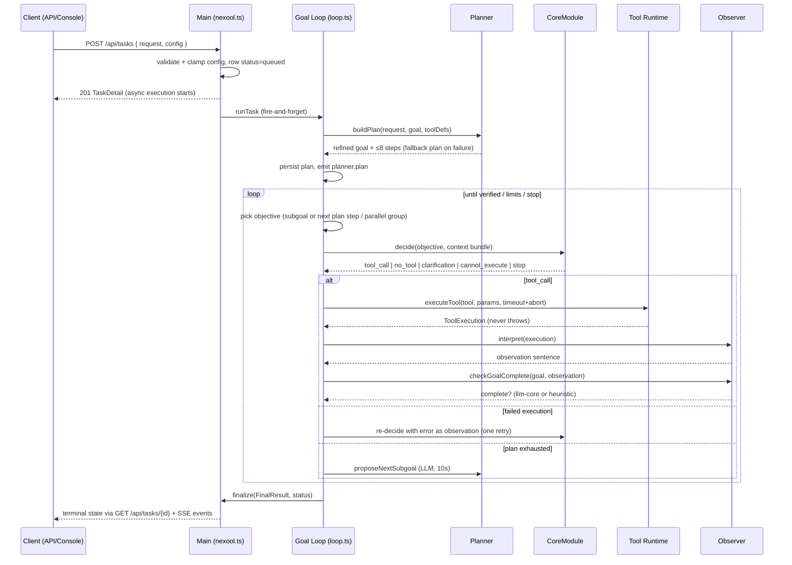

# Goal Mode

Goal Mode is the default mode: a finite pipeline that decomposes a request, executes
tools, observes results and terminates as soon as the goal is verified — or honestly
reports why it could not finish. The mode is used **exactly as provided**; the runtime
never promotes a goal task to live.

## Lifecycle overview

## Phase by phase

1. **Understand / create** — request validated (≤ 4000 chars), config clamped, task row
   created, `task.created` emitted, execution fire-and-forget.
2. **Plan** — LLM decomposition (max 8 steps, optional `parallelGroup` per step, refined
   goal). Deterministic 2-step fallback guarantees the loop can start.
3. **Select tool + generate params** — CoreModule picks ONE tool per objective and
   produces extractive/constructive parameters (see
   [CoreModule](../ai-core/core-module.md)).
4. **Execute** — through the tool runtime with `toolTimeoutMs`, abort signal, stats and
   history. ≥ 2 consecutive pending action steps sharing a `parallelGroup` execute
   **in parallel** (each gets its own decision; if any is not a `tool_call`, the group
   falls back to sequential handling). The batch is capped by `maxSubtoolCalls`.
5. **Observe** — `interpret` produces an operational sentence; the observation is stored
   (ring of 30), emitted (`observer.observed`) and fed into the next decision.
6. **Update state** — plan steps marked completed/failed/skipped, counters persisted,
   active subgoal completed when its action succeeds.
7. **Replan** — plan exhausted but goal unverified? The loop asks the LLM for the next
   dynamic subgoal (10 s timeout). `{"done":true}` ends the task honestly.
8. **Complete** — `checkGoalComplete` (LLM at levels 3–6, success-marker heuristic at
   levels ≤ 2) gates the terminal `completed` status.

## Worked example (real E2E run)

Request: `Check the health of server api-01` (goal mode, defaults).

| Step | What happened |
| --- | --- |
| Plan | LLM produced steps including "Check the health of server api-01" (action) and a verification step. |
| Decision 1 | `core.decision`: `tool_call server.health` with `{"serverId":"api-01"}` (extractive), confidence ~0.95, engine llm-core. |
| Execution | `server.health` drifted + reported: `{ serverId: 'api-01', health: 'healthy', cpu: 34, memory: 51, … }`. |
| Observation | `Server api-01 health: healthy (cpu 34%, mem 51%).` |
| Verify | Goal check → complete. Events `observer.state_changed` + `goal.completed`. |
| Final | `finalResult.status = 'completed'`, summary = the observation, duration a few seconds. |

Failure paths from the same run: a typo request (`moniter the server api-01 and infrom
me…`) still completed; a request with no matching tool terminated honestly (`no_tool`,
informational) rather than inventing an answer.

## Termination matrix

| Trigger | Task status | finalResult.status | errorState |
| --- | --- | --- | --- |
| Goal verified / plan + subgoals done | completed | completed | — |
| Informational `no_tool` | completed | completed | — |
| CoreModule `stop` | stopped | stopped | — |
| User stop | stopped | stopped | — |
| Non-informational `no_tool` | failed | failed | `NO_TOOL` |
| `clarification_required` | failed | failed | `CLARIFICATION_REQUIRED` |
| `cannot_execute` | failed | failed | `NO_CAPABLE_TOOL` |
| Tool failed twice | failed | failed | `TOOL_FAILURE` |
| `maxIterations` / `safetyLimit` hit | failed | limit_reached | `SAFETY_LIMIT` |
| `taskTimeoutMs` exceeded | failed | limit_reached | `TIMEOUT` |
| Loop crash | failed | failed | `RUNTIME_ERROR` / `RUNTIME_CRASH` |

## Configuration knobs that matter here

`reasoningLevel` (observer switches to heuristic verification at ≤ 2), `enabledTools`
(allow-list enforced post-decision), `maxIterations`, `safetyLimit`, `maxSubtoolCalls`,
`taskTimeoutMs`, `toolTimeoutMs`, `useMemory`, `autoExecuteSubtools` — all documented in
[Configuration](../getting-started/configuration.md).

## See also

- [Main](../architecture/main.md) — loop internals.
- [Live Mode](live-mode.md) — the continuous counterpart.
- [Tool Runtime](../tools/tool-runtime.md) — execution, parallelism, retry semantics.
