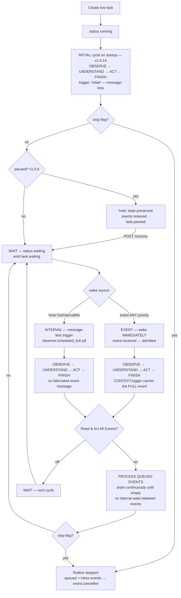

# Live Mode

Live Mode is NexTool's continuous-operation mode: the runtime keeps observing, acting and
recovering indefinitely until explicitly stopped. It is **opt-in only** — `mode` is never
auto-switched, the Task Console gates it behind an amber warning + confirmation switch,
and the config is used exactly as provided.

**v1.0.14 (THE LIVELY AI)** makes Live Mode fully **event-driven**: every event is a
FIRST-CLASS trigger that wakes the task **immediately** (the old priority ≤ 5 wake gate
is gone), the task runs its first cycle **on startup** (no first-interval wait), and each
task owns a **per-task event queue** ("Read & Act All Events") that is drained
continuously until empty. Every admission decision is observable through the
`event.*` lifecycle family (see [Events](events.md#the-event-lifecycle-family-v1014)).

## Activation

- API: `POST /api/tasks` with `config.mode: 'live'` (or top-level `mode: 'live'`).
- Console: Task Console → mode `live` → keep the opt-in confirmation switch on.
- Defaults from settings: `liveIntervalMs` 60 000 ms (clamp 1 000–3 600 000).

## Flow diagram (v1.0.14 — event-driven lifecycle)

One scheduler owns the whole lifecycle (spec §1/§2): **RUN → WAIT → EVENT or INTERVAL →
OBSERVE → UNDERSTAND → ACT → FINISH → PROCESS QUEUED EVENTS → WAIT**. The interval is
now just one of two trigger kinds — events never wait for the next tick.

## Immediate event reaction (v1.0.14)

- **Events wake Live Mode IMMEDIATELY** — `injectEvent` arms the run handle's wake slot
  the moment the event is admitted; a waiting task reacts at once, never at the next
  interval.
- **Initial execution on startup** — every live task runs its first full
  observation/action cycle IMMEDIATELY when it starts (`trigger: 'initial'`). The old
  "wait for the first interval before doing anything" behavior is gone.
- **ALL events are triggers regardless of priority** — the old *priority ≤ 5 wake gate*
  (v1.0.0–v1.0.13) was **REMOVED in v1.0.14**. Priority is now ordering/metadata only
  (queue order: priority ascending, then arrival sequence) and must never silently
  filter an event away. A priority-9 event wakes a live task exactly like a
  priority-1 one.
- **Interval triggers are message-less** — the scheduled tick is
  `{ trigger: 'interval' }` with **no fabricated event message**; the AI performs its
  normal scheduled observation. Event triggers carry the **full event**
  (`id` / `type` / `source` / `message` / `data` / `priority` / `createdAt`) into the
  AI's decision context (`CONTEXT.trigger` in `coremodule.ts`) — the AI observes WHAT
  happened, not just that something did.

## The wait/wake machinery

While waiting, the task row status is `waiting` and a `TaskRunHandle.wake` slot is armed.
`waitWithEvents(liveIntervalMs, handle)` resolves on whichever comes first:

- **Scheduled tick** — the interval timer (unref'd) expires → `observer.scheduled_tick`
  (priority 9) → one observation cycle (message-less interval trigger).
- **Event wake** — `injectEvent` delivers **any** injected event (v1.0.14: no priority
  gate; changed in v1.0.14 — before, only priority ≤ 5 woke the task). Higher
  priorities were persisted/streamed but did not interrupt the wait.

Priority map of typical waking sources (priorities retained for ordering — all of them
wake since v1.0.14): `task.stop` (1), `user.feedback` (2),
`environment.server.crash` (2), `environment.server.degrade`/`.recover` (4),
manual/custom injections and console presets `user.message` / `environment.custom` /
`scheduled.force` (default 5).

## Event-driven wake behaviors (v1.0.14)

Every event lands in the run handle's inbox, is admitted (`event.admitted`) and wakes the
loop immediately; then one observe/understand/act/finish cycle runs with the event as
the trigger. Per-event behavior:

| Wake | Runtime behavior |
| --- | --- |
| `user.message` | **The live conversation channel (§8)** — the message (and any body) reaches the observe/decide pipeline verbatim so the AI can answer questions, take corrections and act. The cycle is immediate — this is how the operator chats with a live task (and how the [Assistant](frontend.md#v1014-frontend-changes) conversation works). |
| `user.feedback` | Emits `observer.feedback_applied`; upserts persistent memory `feedback_<taskId>` (`{ message, correctAction, at }`, tags `['feedback','live']`) when `learnFrom.feedback`; asks the LLM (10 s) to revise the active subgoal, falling back to `correctAction` or a generic title; emits `subgoal.created`; then runs an **immediate correction cycle** (v1.0.14 — the revised subgoal is acted upon at once, no interval wait). |
| `environment.server.crash` etc. | Resolves the serverId from the payload (or the first non-healthy server) and runs `runRepairPasses`: recovery subgoal → `server.health` → if unhealthy `server.restart` (fleet turns healthy after 2 500 ms; pass settles 2 700 ms) → verify `server.health` → subgoal completed/failed. ≤ 4 tool calls per pass. |
| Scheduled tick | One `liveObserveCycle` ("keep making progress on: <goal>" + serialized fleet state), message-less interval trigger. Afterward, if the goal mentions monitoring (`monitor|recover|production|prod|api|server|health|web|db`) and any server is unhealthy/degraded, repair passes run for each. |
| Generic event (any type, any priority) | One observation cycle carrying the FULL event body via `CONTEXT.trigger`, skipped if the per-cycle deadline (`Date.now() + taskTimeoutMs`) already passed. |

## One-by-one planner in Live Mode (v1.0.10)

A live task can run on either planner strategy (per-task `plannerType` / global
`defaultPlannerType`, resolved at creation — see
[Planner](planner.md#planner-modes-v1010)). With **`one-by-one`**, the live loop
changes shape without changing its safeguards:

- **One action per tick/event** — each scheduled tick or event wake plans exactly ONE
  action from the CURRENT world state (never a hidden future list), executes it,
  observes the result, and verifies the goal.
- **Goal evidence is recorded** — the goal check runs on the latest observation and its
  evidence is recorded; when it passes, `planner.one_by_one_goal_reached` (with
  `live: true`) fires. **The live task CONTINUES across ticks — it is not torn down**
  by a passing goal check (Live Mode's contract is unchanged: only Stop ends a live
  task).
- **Failure handling** — same as Goal Mode one-by-one: no blind retry; the failure is
  recorded and observed, then ONE step is replanned with the failure context
  (`planner.one_by_one_replanned`), with the endless-repetition guard and the
  deterministic fallback (never zero steps).
- **Repair passes are unchanged** — environment-driven repair
  (`runRepairPasses` on crash/degrade wakes) behaves identically for BOTH planner
  types; the planner strategy only governs how the next autonomous action is chosen.
  **v1.0.11 note:** the new pre-plan failure-recovery state machine applies to GOAL
  tasks on the pre-plan strategy only — one-by-one live/live tasks keep exactly the
  failure handling above, and repair passes are untouched by it.
- **Safeguards still bound the loop** — `maxIterations`, `safetyLimit` and
  `taskTimeoutMs` apply to one-by-one exactly as to pre-plan (a verification task hit
  `SAFETY_LIMIT` at `maxIterations=12` as designed).

## Per-task event queue — "Read & Act All Events" (v1.0.6, event-driven since v1.0.14)

Multi-event mode gives every live task an **owned, ordered event queue** — the
"Read & Act All Events" contract: each task owns its queue, and the queue is drained
CONTINUOUSLY until empty (no interval waits between queued events).

- **Nothing is lost** — events arriving while the loop is busy, paused or waiting land
  in the run handle's **inbox** (`handle.inbox`) immediately and are admitted into the
  persisted task queue (`state.eventQueue`). The inbox is drained **before every wait**
  (v1.0.14 §2.1), so events that arrived while the previous action ran are processed
  IMMEDIATELY — never after another interval.
- **Continuous drain** — after each event's cycle the loop proceeds straight to the next
  queued event (§2.1: drain continuously until empty). A backlog of 3 events finishes
  back-to-back even with a 300 s interval.
- **The queue is durable state** — queued events are stored in the task's state
  (`state.eventQueue`), so the queue survives page refreshes, SSE reconnects and
  pauses. Live Monitor and Task Preview render it (status per item: queued / processing /
  processed / failed / dropped / cancelled).
- **One-by-one processing** — no two event-driven action plans ever run concurrently.
  The queue is drained in deterministic order: **priority ascending (1 = emergency
  first), then arrival sequence (`seq`)**.
- **Limits & admission policy** — max queued events from the central limit
  `task.eventQueueCap` (shipped 50); a payload over **16 KiB** is truncated to
  metadata. When the queue is full, the **lowest-priority** item is displaced first; if
  the incoming event is lower priority than everything queued, the incoming event is
  **rejected**. Every displacement/rejection emits an observable `event.rejected` with
  the reason — never silent (v1.0.14: the former `live.event.dropped` type).
- **Failed events never deadlock the queue (§32)** — a failing event cycle is recorded
  (`event.failed` with the error) and the NEXT queued event proceeds immediately.
- **Distinct from `parallelToolCalls`** — multi-event mode sequences *event-driven
  decisions*; parallel tool calls batch *tool executions inside one plan step*. They
  solve different problems and are configured independently (spec §10 vs §14).

### Without "Read & Act All Events" — NO backlog (v1.0.14 §2.2)

The default (`allowMultipleEvents: false`) keeps single-event processing but — changed
in v1.0.14 — it is now **honest about it**:

- While an action runs (or another event is still pending), later incoming events are
  **REJECTED** with the observable reason *"Live action already running and Read & Act
  All Events is disabled."* — an `event.rejected` lifecycle record is emitted and
  rendered in Events / Task Preview / Live Monitor. **No hidden backlog is allowed to
  form** (v1.0.6–v1.0.13 silently kept the latest event instead).
- The **first pending event is still processed at the next safe point** — the
  single-event path reports the same lifecycle as the queue path
  (`event.processing` → `event.completed` / `event.failed`).
- **Pause retention is preserved (§11.4)** — while the task is PAUSED, events are still
  retained (queued for after resume); user messages must never be lost during an
  operator pause. The rejection only applies while an action is actively running.

### Event lifecycle states (v1.0.14 §12)

Every injected event moves through an observable lifecycle — emitted as first-class
`event.*` runtime events and rendered in Events, Task Preview and Live Monitor:

`event.received` → `event.admitted` (or `event.rejected` / `event.ignored`) →
`event.queued` (queue mode) → `event.processing` → `event.completed`
(or `event.failed` with the reason; `event.cancelled` on task stop).

Full catalog with payloads: [Events → The event lifecycle family](events.md#the-event-lifecycle-family-v1014).

Configuration: global setting `allowMultipleEvents` (default `false`), per-task
`config.allowMultipleEvents` — both exposed as the **"Allow Multiple Events at Same
Time"** / **"Read & Act All Events"** switches (Settings / Task Console — same
underlying config). The injected-event endpoint is unchanged:
`POST /api/tasks/{id}/event`.

## Pause and resume (v1.0.6)

- `POST /api/tasks/{id}/pause` (or the **Pause** button in Live Monitor / Task
  Preview) suspends the task between steps: the current atomic tool execution finishes
  first, then the loop parks (`task.paused`, status `paused`, rendered sky-blue).
- **Everything is preserved** — task, plan, subgoal, context, Live State (including
  the event queue), history. The scheduler holds: no ticks fire while paused, and on
  resume the interval restarts fresh (no burst of missed ticks).
- **Events during pause are retained** — multi-event mode queues them (nothing lost);
  single-event mode keeps the first for processing right after resume (§11.4 behavior,
  preserved in v1.0.14 — the "no backlog" rejection does NOT apply while paused).
- `POST /api/tasks/{id}/resume` continues from the preserved state — never a restart.
  The task returns to `waiting`/`running` (`task.resumed`).
- **Pause during an approval**: the approval stays unresolved (never auto-allowed or
  denied) and its 5-minute timeout remains well-defined; the task displays `paused`
  while waiting.
- Honest limitation: if the server process dies while paused, the task stays `paused`
  in the DB and cannot resume (runtime handles are in-memory); Stop still works.

See [Runtime](../architecture/runtime.md#pause-and-resume-v106) for the state-machine
view.

## User feedback in practice

Feedback is the Live Mode steering wheel. From Task Preview (or
`POST /api/tasks/{id}/feedback` with `{ message, correctAction? }`):

1. The priority-2 event interrupts the wait immediately.
2. The correction is persisted to **Persistent Memory** (survives restarts, visible in
   the Memory view).
3. The active subgoal is revised — verified E2E: a feedback event made the planner swap
   the current subgoal within seconds (`subgoal.created` with the LLM-revised title).

## Persistent memory use in Live Mode

- Feedback entries: `feedback_<taskId>` (above).
- The context bundle given to every decision includes the 5 most recently updated
  memory entries when `config.useMemory` is on — so anything stored via `memory.store`
  (by the runtime or by you through `/api/memory`) shapes later decisions.
- Live tasks can call `memory.store` / `memory.recall` like any tool, building their own
  long-term knowledge (see [Memory](../data/memory.md)).

## Live State & the virtual fleet

Live tasks act on the in-memory virtual server fleet (api-01, web-01, db-01): health
checks drift cpu/mem and can flip health; restarts follow the 2 500 ms state machine;
crash/degrade injections (Live State & Live Monitor buttons, or `POST /api/env/event`)
broadcast to **every active live task**. The aggregated view is `GlobalLiveState`
(`runtimeStatus`: online/degraded/offline, active goal/live counts) — see
[Live State](../data/live-state.md).

## Context delta

Each cycle's context bundle = state summary (mode, iteration, tool call count, active
subgoal, plan statuses, fleet health) + last observation + recent memory + recent
history for this task. The composed view (previous context + delta + observation +
memory + history) is exposed per task via `GET /api/tasks/{id}/context` — see
[Context](../data/context.md).

## Tool approvals & prompts in Live Mode (v1.0.6)

- If a tool's `autoExecute` is false (default) and no global/task override applies,
  every event-driven execution first emits `tool.approval.required`; the task parks in
  `awaiting_approval` (or `paused` if you paused it meanwhile) and an Allow/Deny card —
  tool, purpose, params, subgoal — renders in Live Monitor / Task Preview. A 5-minute
  timeout stops the task; a denial skips the tool (feedback optional). See
  [Tool Runtime](../tools/tool-runtime.md#the-approval-gate-v106).
- A tool's `await prompt(...)` renders an answer/cancel card the same way (120 s
  timeout → `null`); `await alert(...)` — **changed in v1.0.14** — now renders an
  interactive OK dialog that pauses the tool until dismissed (120 s auto-dismiss),
  backed by `GET/POST /api/alerts`. Only that tool waits — the rest of the runtime
  keeps observing.

## Stopping

`POST /api/tasks/{id}/stop` (or the Task Preview/Live Monitor stop buttons):

1. `stopFlag` set + `AbortController` aborts any in-flight execution.
2. Synthetic `task.stop` (priority 1) breaks the wait loop instantly.
3. **Pending events are cancelled observably (v1.0.14 §31)** — every inbox event emits
   `event.cancelled` ("Task stopped by user — pending event cancelled."), the in-memory
   inbox is dropped, and any still-queued/processing entries in the persisted queue are
   marked `cancelled` with the same reason. Nothing runs after the stop.
4. Pending interactive alerts auto-dismiss (`tool.user_alert.dismissed`); approvals,
   prompts, confirmations, choices, verifications and continuations flush as before.
5. Finalize: status `stopped`, summary = last observation, `task.cancelled` event.

Live tasks never complete on their own — stopping is the only exit besides a crash.

## Observability

- Live Monitor view: 3 s polls of `/api/state` + live tasks, per-task subgoal /
  observation / event counts, interval + next-tick estimate, fleet cards with injection
  buttons, filtered event terminal; v1.0.6 adds **Pause/Resume** buttons, pending
  **approval cards** (Allow/Deny + optional deny feedback), **prompt cards**
  (answer/cancel) and the **event-queue panel** (multi-event mode); v1.0.14 adds
  **alert cards** (OK-dismiss) and live `event.*` lifecycle records in the stream.
- Task Preview: same task view as goal tasks (2.5 s poll while active + SSE timeline)
  with the same additions (pause/resume, approvals, prompts, queue, alerts).
- Key events: `task.waiting` (7), `observer.scheduled_tick` (9), `observer.event_wake`
  (5), `observer.feedback_applied` (3), `subgoal.created` (3), `env.server.*` (2–4);
  v1.0.6: `task.paused` (2), `task.resumed` (3), `tool.approval.*` (2–3);
  v1.0.14: the **`event.*` lifecycle family** (`event.received/.admitted/.queued/
  .processing/.completed/.rejected/.failed/.cancelled`, priority 5–8) — the old
  `live.event.*` types were retired (see [Events](events.md)).
