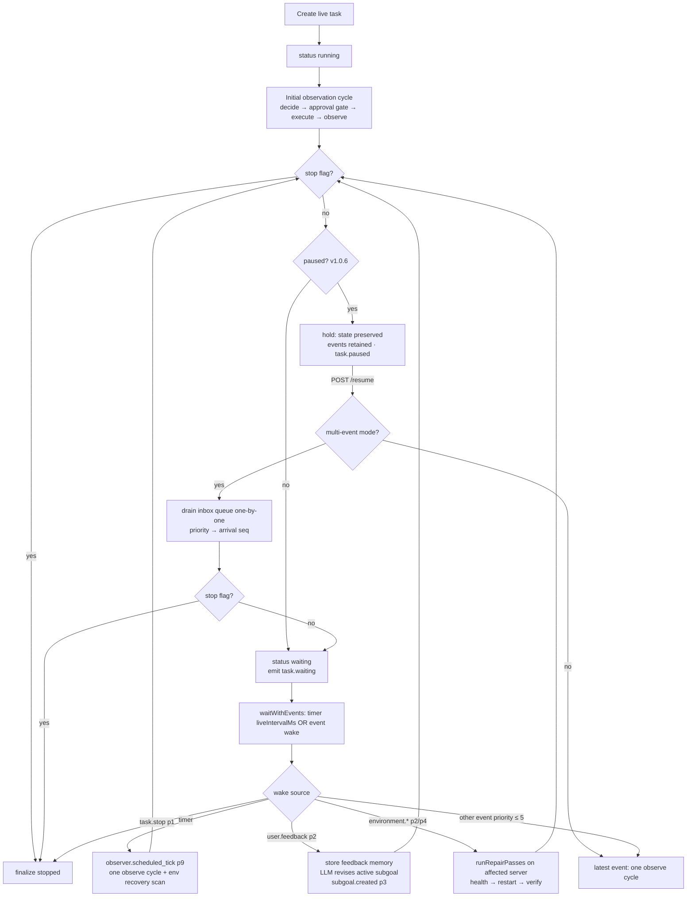

# Live Mode

Live Mode is NexTool's continuous-operation mode: the runtime keeps observing, acting and
recovering indefinitely until explicitly stopped. It is **opt-in only** — `mode` is never
auto-switched, the Task Console gates it behind an amber warning + confirmation switch,
and the config is used exactly as provided.

## Activation

- API: `POST /api/tasks` with `config.mode: 'live'` (or top-level `mode: 'live'`).
- Console: Task Console → mode `live` → keep the opt-in confirmation switch on.
- Defaults from settings: `liveIntervalMs` 60 000 ms (clamp 1 000–3 600 000).

## Flow diagram

## The wait/wake machinery

While waiting, the task row status is `waiting` and a `TaskRunHandle.wake` slot is armed.
`waitWithEvents(liveIntervalMs, handle)` resolves on whichever comes first:

- **Scheduled tick** — the interval timer (unref'd) expires → `observer.scheduled_tick`
  (priority 9) → one observation cycle.
- **Event wake** — `injectEvent` delivers any event with **priority ≤ 5**. Higher
  priorities are persisted/streamed but do not interrupt the wait.

Priority map of waking sources: `task.stop` (1), `user.feedback` (2),
`environment.server.crash` (2), `environment.server.degrade`/`.recover` (4),
manual/custom injections and console presets `user.message` / `environment.custom` /
`scheduled.force` (default 5).

## Event-driven wake behaviors

| Wake | Runtime behavior |
| --- | --- |
| `user.feedback` | Emits `observer.feedback_applied`; upserts persistent memory `feedback_<taskId>` (`{ message, correctAction, at }`, tags `['feedback','live']`) when `learnFrom.feedback`; asks the LLM (10 s) to revise the active subgoal, falling back to `correctAction` or a generic title; emits `subgoal.created`. |
| `environment.server.crash` etc. | Resolves the serverId from the payload (or the first non-healthy server) and runs `runRepairPasses`: recovery subgoal → `server.health` → if unhealthy `server.restart` (fleet turns healthy after 2 500 ms; pass settles 2 700 ms) → verify `server.health` → subgoal completed/failed. ≤ 4 tool calls per pass. |
| Scheduled tick | One `liveObserveCycle` ("keep making progress on: <goal>" + serialized fleet state). Afterward, if the goal mentions monitoring (`monitor|recover|production|prod|api|server|health|web|db`) and any server is unhealthy/degraded, repair passes run for each. |
| Generic event | One observation cycle, skipped if the per-cycle deadline (`Date.now() + taskTimeoutMs`) already passed. |

## One-by-one planner in Live Mode (v1.0.10)

A live task can run on either planner strategy (per-task `plannerType` / global
`defaultPlannerType`, resolved at creation — see
[Planner](planner.md#planner-modes-v1010)). With **`one-by-one`**, the live loop
changes shape without changing its safeguards:

- **One action per tick/event** — each scheduled tick or event wake plans exactly ONE
  action from the CURRENT world state (never a hidden future list), executes it,
  observes the result, and verifies the goal.
- **Goal evidence is recorded** — the goal check runs on the latest observation and its
  evidence is recorded; when it passes, `planner.one_by_one_goal_reached` (with
  `live: true`) fires. **The live task CONTINUES across ticks — it is not torn down**
  by a passing goal check (Live Mode's contract is unchanged: only Stop ends a live
  task).
- **Failure handling** — same as Goal Mode one-by-one: no blind retry; the failure is
  recorded and observed, then ONE step is replanned with the failure context
  (`planner.one_by_one_replanned`), with the endless-repetition guard and the
  deterministic fallback (never zero steps).
- **Repair passes are unchanged** — environment-driven repair
  (`runRepairPasses` on crash/degrade wakes) behaves identically for BOTH planner
  types; the planner strategy only governs how the next autonomous action is chosen.
- **Safeguards still bound the loop** — `maxIterations`, `safetyLimit` and
  `taskTimeoutMs` apply to one-by-one exactly as to pre-plan (a verification task hit
  `SAFETY_LIMIT` at `maxIterations=12` as designed).

## Multi-event mode — "Read & Act All Events" (v1.0.6)

By default (v1.0.5 behavior, `allowMultipleEvents: false`) a live task processes one
event per wake — an event arriving while a cycle runs is not acted on as its own
decision. Multi-event mode changes exactly that:

- **Nothing is lost** — events arriving while the loop is busy, paused or waiting land
  in the run handle's **inbox** (`handle.inbox`) immediately (the wake only interrupts
  the wait so the loop drains at the next safe point).
- **The queue is durable state** — queued events are stored in the task's state
  (`state.eventQueue`), so the queue survives page refreshes and SSE reconnects. Live
  Monitor and Task Preview render it (status per item: queued / processing /
  processed).
- **One-by-one processing** — no two event-driven action plans ever run concurrently.
  The queue is drained in deterministic order: **priority ascending (1 = emergency
  first), then arrival sequence (`seq`)**.
- **Limits & drop policy** — max **50** queued events; a payload over **16 KiB** is
  truncated to metadata. When the queue is full, the **lowest-priority** item is
  dropped first; if the incoming event is lower priority than everything queued, the
  incoming event is dropped. Every drop emits `live.event.dropped` — drops are
  recorded, never silent. Processed history is trimmed to the last 10 so the queue
  stays a queue.
- **Events** — `live.event.queued` (6), `live.event.processing` (6),
  `live.event.processed` (7), `live.event.dropped` (6).
- **Distinct from `parallelToolCalls`** — multi-event mode sequences *event-driven
  decisions*; parallel tool calls batch *tool executions inside one plan step*. They
  solve different problems and are configured independently (spec §10 vs §14).

Configuration: global setting `allowMultipleEvents` (default `false`), per-task
`config.allowMultipleEvents` — both exposed as the **"Allow Multiple Events at Same
Time"** / **"Read & Act All Events"** switches (Settings / Task Console — same
underlying config). The injected-event endpoint is unchanged:
`POST /api/tasks/{id}/event`.

## Pause and resume (v1.0.6)

- `POST /api/tasks/{id}/pause` (or the **Pause** button in Live Monitor / Task
  Preview) suspends the task between steps: the current atomic tool execution finishes
  first, then the loop parks (`task.paused`, status `paused`, rendered sky-blue).
- **Everything is preserved** — task, plan, subgoal, context, Live State (including
  the event queue), history. The scheduler holds: no ticks fire while paused, and on
  resume the interval restarts fresh (no burst of missed ticks).
- **Events during pause are retained** — multi-event mode queues them (nothing lost);
  single-event mode processes the first after resume.
- `POST /api/tasks/{id}/resume` continues from the preserved state — never a restart.
  The task returns to `waiting`/`running` (`task.resumed`).
- **Pause during an approval**: the approval stays unresolved (never auto-allowed or
  denied) and its 5-minute timeout remains well-defined; the task displays `paused`
  while waiting.
- Honest limitation: if the server process dies while paused, the task stays `paused`
  in the DB and cannot resume (runtime handles are in-memory); Stop still works.

See [Runtime](../architecture/runtime.md#pause-and-resume-v106) for the state-machine
view.

## User feedback in practice

Feedback is the Live Mode steering wheel. From Task Preview (or
`POST /api/tasks/{id}/feedback` with `{ message, correctAction? }`):

1. The priority-2 event interrupts the wait immediately.
2. The correction is persisted to **Persistent Memory** (survives restarts, visible in
   the Memory view).
3. The active subgoal is revised — verified E2E: a feedback event made the planner swap
   the current subgoal within seconds (`subgoal.created` with the LLM-revised title).

## Persistent memory use in Live Mode

- Feedback entries: `feedback_<taskId>` (above).
- The context bundle given to every decision includes the 5 most recently updated
  memory entries when `config.useMemory` is on — so anything stored via `memory.store`
  (by the runtime or by you through `/api/memory`) shapes later decisions.
- Live tasks can call `memory.store` / `memory.recall` like any tool, building their own
  long-term knowledge (see [Memory](../data/memory.md)).

## Live State & the virtual fleet

Live tasks act on the in-memory virtual server fleet (api-01, web-01, db-01): health
checks drift cpu/mem and can flip health; restarts follow the 2 500 ms state machine;
crash/degrade injections (Live State & Live Monitor buttons, or `POST /api/env/event`)
broadcast to **every active live task**. The aggregated view is `GlobalLiveState`
(`runtimeStatus`: online/degraded/offline, active goal/live counts) — see
[Live State](../data/live-state.md).

## Context delta

Each cycle's context bundle = state summary (mode, iteration, tool call count, active
subgoal, plan statuses, fleet health) + last observation + recent memory + recent
history for this task. The composed view (previous context + delta + observation +
memory + history) is exposed per task via `GET /api/tasks/{id}/context` — see
[Context](../data/context.md).

## Tool approvals & prompts in Live Mode (v1.0.6)

- If a tool's `autoExecute` is false (default) and no global/task override applies,
  every event-driven execution first emits `tool.approval.required`; the task parks in
  `awaiting_approval` (or `paused` if you paused it meanwhile) and an Allow/Deny card —
  tool, purpose, params, subgoal — renders in Live Monitor / Task Preview. A 5-minute
  timeout stops the task; a denial skips the tool (feedback optional). See
  [Tool Runtime](../tools/tool-runtime.md#the-approval-gate-v106).
- A tool's `await prompt(...)` renders an answer/cancel card the same way (120 s
  timeout → `null`); `await alert(...)` shows as a `tool.user_alert` line. Only that
  tool waits — the rest of the runtime keeps observing.

## Stopping

`POST /api/tasks/{id}/stop` (or the Task Preview/Live Monitor stop buttons):

1. `stopFlag` set + `AbortController` aborts any in-flight execution.
2. Synthetic `task.stop` (priority 1) breaks the wait loop instantly.
3. Finalize: status `stopped`, summary = last observation, `task.cancelled` event.

Live tasks never complete on their own — stopping is the only exit besides a crash.

## Observability

- Live Monitor view: 3 s polls of `/api/state` + live tasks, per-task subgoal /
  observation / event counts, interval + next-tick estimate, fleet cards with injection
  buttons, filtered event terminal; v1.0.6 adds **Pause/Resume** buttons, pending
  **approval cards** (Allow/Deny + optional deny feedback), **prompt cards**
  (answer/cancel) and the **event-queue panel** (multi-event mode).
- Task Preview: same task view as goal tasks (2.5 s poll while active + SSE timeline)
  with the same v1.0.6 additions (pause/resume, approvals, prompts, queue).
- Key events: `task.waiting` (7), `observer.scheduled_tick` (9), `observer.event_wake`
  (5), `observer.feedback_applied` (3), `subgoal.created` (3), `env.server.*` (2–4);
  v1.0.6: `task.paused` (2), `task.resumed` (3), `tool.approval.*` (2–3),
  `live.event.*` (6–7).
