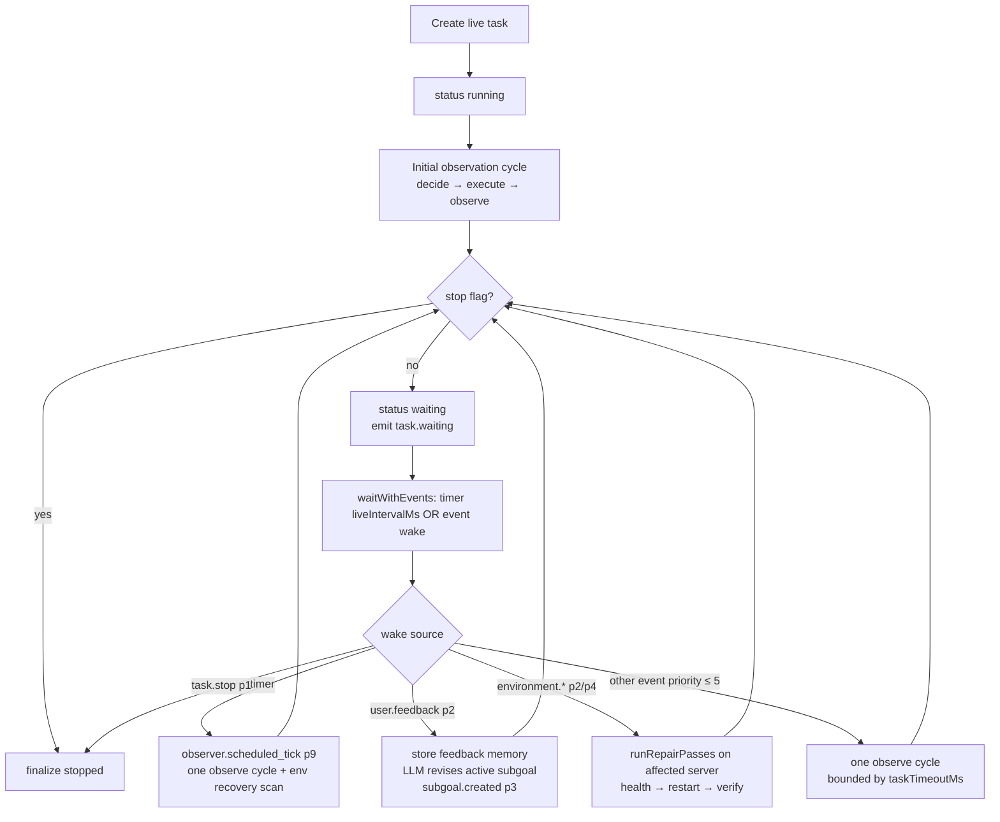

# Live Mode

Live Mode is NexTool's continuous-operation mode: the runtime keeps observing, acting and
recovering indefinitely until explicitly stopped. It is **opt-in only** — `mode` is never
auto-switched, the Task Console gates it behind an amber warning + confirmation switch,
and the config is used exactly as provided.

## Activation

- API: `POST /api/tasks` with `config.mode: 'live'` (or top-level `mode: 'live'`).
- Console: Task Console → mode `live` → keep the opt-in confirmation switch on.
- Defaults from settings: `liveIntervalMs` 60 000 ms (clamp 1 000–3 600 000).

## Flow diagram

## The wait/wake machinery

While waiting, the task row status is `waiting` and a `TaskRunHandle.wake` slot is armed.
`waitWithEvents(liveIntervalMs, handle)` resolves on whichever comes first:

- **Scheduled tick** — the interval timer (unref'd) expires → `observer.scheduled_tick`
  (priority 9) → one observation cycle.
- **Event wake** — `injectEvent` delivers any event with **priority ≤ 5**. Higher
  priorities are persisted/streamed but do not interrupt the wait.

Priority map of waking sources: `task.stop` (1), `user.feedback` (2),
`environment.server.crash` (2), `environment.server.degrade`/`.recover` (4),
manual/custom injections and console presets `user.message` / `environment.custom` /
`scheduled.force` (default 5).

## Event-driven wake behaviors

| Wake | Runtime behavior |
| --- | --- |
| `user.feedback` | Emits `observer.feedback_applied`; upserts persistent memory `feedback_<taskId>` (`{ message, correctAction, at }`, tags `['feedback','live']`) when `learnFrom.feedback`; asks the LLM (10 s) to revise the active subgoal, falling back to `correctAction` or a generic title; emits `subgoal.created`. |
| `environment.server.crash` etc. | Resolves the serverId from the payload (or the first non-healthy server) and runs `runRepairPasses`: recovery subgoal → `server.health` → if unhealthy `server.restart` (fleet turns healthy after 2 500 ms; pass settles 2 700 ms) → verify `server.health` → subgoal completed/failed. ≤ 4 tool calls per pass. |
| Scheduled tick | One `liveObserveCycle` ("keep making progress on: <goal>" + serialized fleet state). Afterward, if the goal mentions monitoring (`monitor|recover|production|prod|api|server|health|web|db`) and any server is unhealthy/degraded, repair passes run for each. |
| Generic event | One observation cycle, skipped if the per-cycle deadline (`Date.now() + taskTimeoutMs`) already passed. |

## User feedback in practice

Feedback is the Live Mode steering wheel. From Task Preview (or
`POST /api/tasks/{id}/feedback` with `{ message, correctAction? }`):

1. The priority-2 event interrupts the wait immediately.
2. The correction is persisted to **Persistent Memory** (survives restarts, visible in
   the Memory view).
3. The active subgoal is revised — verified E2E: a feedback event made the planner swap
   the current subgoal within seconds (`subgoal.created` with the LLM-revised title).

## Persistent memory use in Live Mode

- Feedback entries: `feedback_<taskId>` (above).
- The context bundle given to every decision includes the 5 most recently updated
  memory entries when `config.useMemory` is on — so anything stored via `memory.store`
  (by the runtime or by you through `/api/memory`) shapes later decisions.
- Live tasks can call `memory.store` / `memory.recall` like any tool, building their own
  long-term knowledge (see [Memory](../data/memory.md)).

## Live State & the virtual fleet

Live tasks act on the in-memory virtual server fleet (api-01, web-01, db-01): health
checks drift cpu/mem and can flip health; restarts follow the 2 500 ms state machine;
crash/degrade injections (Live State & Live Monitor buttons, or `POST /api/env/event`)
broadcast to **every active live task**. The aggregated view is `GlobalLiveState`
(`runtimeStatus`: online/degraded/offline, active goal/live counts) — see
[Live State](../data/live-state.md).

## Context delta

Each cycle's context bundle = state summary (mode, iteration, tool call count, active
subgoal, plan statuses, fleet health) + last observation + recent memory + recent
history for this task. The composed view (previous context + delta + observation +
memory + history) is exposed per task via `GET /api/tasks/{id}/context` — see
[Context](../data/context.md).

## Stopping

`POST /api/tasks/{id}/stop` (or the Task Preview/Live Monitor stop buttons):

1. `stopFlag` set + `AbortController` aborts any in-flight execution.
2. Synthetic `task.stop` (priority 1) breaks the wait loop instantly.
3. Finalize: status `stopped`, summary = last observation, `task.cancelled` event.

Live tasks never complete on their own — stopping is the only exit besides a crash.

## Observability

- Live Monitor view: 3 s polls of `/api/state` + live tasks, per-task subgoal /
  observation / event counts, interval + next-tick estimate, fleet cards with injection
  buttons, filtered event terminal.
- Task Preview: same task view as goal tasks (2.5 s poll while active + SSE timeline).
- Key events: `task.waiting` (7), `observer.scheduled_tick` (9), `observer.event_wake`
  (5), `observer.feedback_applied` (3), `subgoal.created` (3), `env.server.*` (2–4).
