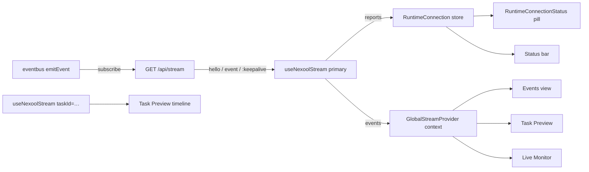

# Realtime (SSE)

NexTool's realtime layer is one Server-Sent-Events endpoint plus a centralized frontend
connection store. Transport is `sse` — a WebSocket adapter is **not installed** in this
environment, and the Settings view shows the transport as locked for that reason.

## Endpoint

`GET /api/stream?taskId=<id>&since=<ISO | epoch-ms>`

- `taskId` — filter the stream to a single task's events.
- `since` — ISO string or epoch ms; the server replays events with `createdAt > since`
  (epoch numbers without dashes are converted to ISO).

Response headers: `Content-Type: text/event-stream; charset=utf-8`,
`Cache-Control: no-cache, no-transform`, `Connection: keep-alive`, and
**`X-Accel-Buffering: no`** (disables nginx-style proxy buffering — see
[Deployment](../operations/deployment.md)).

## Frame protocol

```
event: hello
data: {"ok":true,"since":"2024-…","taskId":null}

event: event
data: {"id":"evt_…","taskId":"task_…","type":"tool.completed","source":"tool",
       "message":"server.health → completed","data":{…},"priority":6,
       "createdAt":"2024-…"}

:keepalive
```

- **`hello`** — sent once on connect; confirms the stream is live (the frontend flips to
  `connected` on this frame).
- **`event`** — one `NexToolEvent` JSON per frame, newest last. After `hello`, the
  server first replays matching in-memory events (ring buffer of 500, filtered by
  `since`/`taskId`, capped 300 per connection), then pushes live events as they occur.
- **`:keepalive`** — SSE comment every **15 s** to keep intermediaries from closing an
  idle connection (the interval is `unref`'d).

Disconnection handling is server-side clean: on `request.signal` abort (or stream
cancel) the connection unregisters, the heartbeat stops and the subscriber is removed.
Events themselves are persisted to `TaskEvent` independently, so no event is ever lost
by a reconnect — only the replay window is bounded by the 500-event ring.

## Frontend subscription — `useNexoolStream`

`src/hooks/use-nexool-stream.ts` wraps `EventSource` with:

- **Dedup** — a `seen` set of event ids survives reconnect rebuilds, so replayed events
  never duplicate; malformed frames are ignored without killing the stream.
- **Buffer cap** — `max` (default 500) events kept, newest last.
- **Options** — `taskId`, `since`, `max`, and `primary`. Only the **primary** stream
  (the one opened by `GlobalStreamProvider`, replaying the last 15 minutes) reports into
  the global connection store; task-filtered secondary streams (Task Preview) keep their
  status local so they never disturb the global indicator.
- Returns `{ events, connected, status }` with hook-level status
  `connecting | live | offline`.

## Connection states — `RuntimeConnection` store

`src/lib/nexool/connection.ts` (zustand) is the single source of truth consumed by
`RuntimeConnectionStatus` and the status bar:

| State | Meaning |
| --- | --- |
| `connecting` | Stream opening (initial or retry in flight). |
| `connected` | `hello` received; SSE live. |
| `disconnected` | Intentional teardown (navigation/unmount) — not an outage. |
| `reconnecting` | Automatic retry scheduled; `reconnectAttempts` + `nextRetryAt` exposed. |
| `error` | Retry budget exhausted; waiting for manual reconnect or tab refocus. |

Store fields: `status`, `transport` (`sse`), `endpoint` (`/api/stream`), `runtimeName`,
`frontendLoadedAt` (when the SPA loaded — deliberately distinct from runtime health),
`lastConnectedAt`, `lastEventAt`, `reconnectAttempts`, `nextRetryAt`,
`reconnectRequestedAt` (nonce; bumping it forces the stream to rebuild).

## Reconnect policy

```
delay(attempt) = min(1000 · 2^(attempt−1), 10 000) ± 15% jitter
max attempts   = 8 (RECONNECT_MAX_ATTEMPTS)
```

Sequence: 1 s → 2 s → 4 s → 8 s → 10 s (cap) with ±15% jitter, then `error`. A
successful `hello` resets attempts to 0. Deliberately no aggressive infinite loop.

**Recovery paths** after `error`:
- `visibilitychange` → tab becomes visible again → one fresh retry budget (connect()
  with `attempts = 0`), so a laptop that slept doesn't stay stuck.
- The **Reconnect now** button in the connection popover bumps
  `reconnectRequestedAt`, which the hook's effect key includes — rebuilding the stream.

## `RuntimeConnectionStatus` component

Header pill (v1.0.1) that is accessible by construction — the state is always conveyed
by text and color (never color alone) and exposed via `role="status"` + a full
`aria-label`. The popover shows:

- Runtime / Engine / Uptime (from SystemStats — uptime and engine identity),
- Transport + endpoint, Connection state, Last connected, Last event,
- Reconnect attempts (+ live countdown to `nextRetryAt` while reconnecting),
- Frontend loaded at, and the clarifying note: *"Connected means active SSE to runtime,
  not merely loaded frontend"*,
- A **Reconnect now** action.

The status bar (desktop) mirrors a compact `stream: <state>` indicator with a colored
dot.

## Wiring summary



## Quick test

```bash
curl -N "http://localhost:3000/api/stream?since=0" --max-time 5
# then, in another shell: curl -X POST .../api/tasks -d '{"request":"echo hello"}'
```
