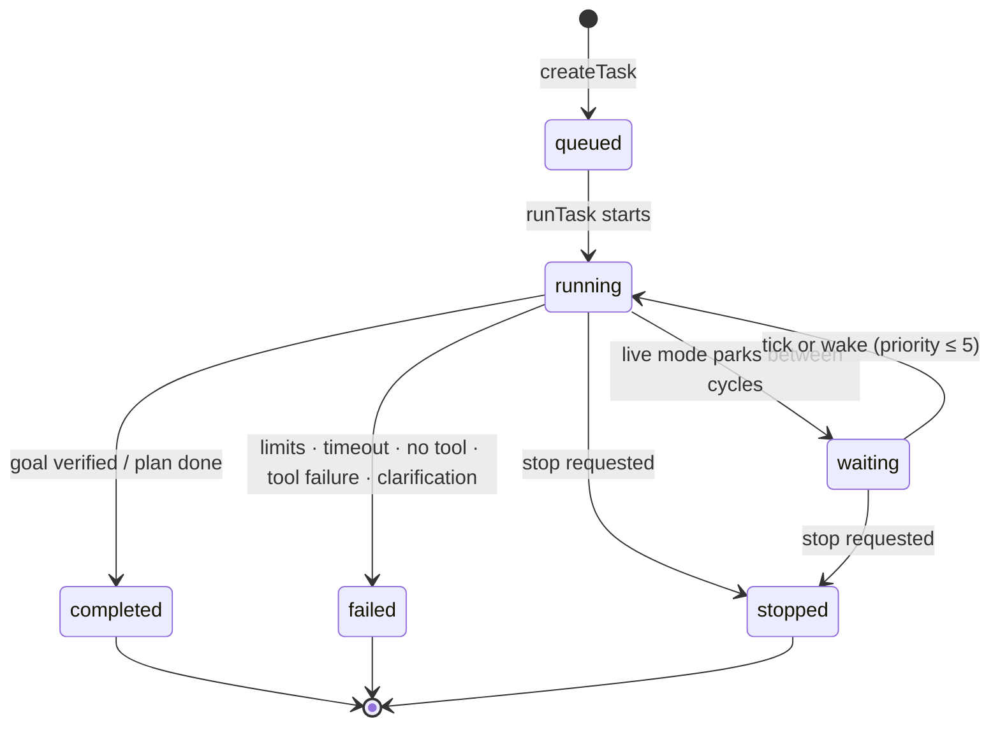

# Runtime — task lifecycle, limits, cancellation

This page is the operational reference for what a task experiences between
`POST /api/tasks` and its terminal state.

## Task lifecycle states

`TaskStatus`: `queued → running → (waiting) → completed | failed | stopped`
(`cancelled` exists in the type union for parity; the loop finalizes user stops as
`stopped`).

Transitions are persisted immediately (`db.task.update`); the console's Task Preview
polls the detail every 2.5 s while a task is active and merges SSE events on top.

## A task's life in one table

| Phase | What happens | Events |
| --- | --- | --- |
| Created | Row written (`queued`), config clamped, handle registered. | `task.created` (6) |
| Started | Status `running`, tool defs loaded, plan built + stored. | `task.started` (5), `planner.plan_built` (6), `planner.plan` (5) |
| Iterating | CoreModule decides, tools execute (independent steps concurrently in capped parallel batches — v1.0.3), observer interprets, state persists. | `core.decision` (4), `planner.parallel_batch` (5), `planner.partial_failure` (4), `tool.started/completed/…` (4–6), `observer.observed` (6) |
| Waiting (live) | Parked between cycles. | `task.waiting` (7), `observer.scheduled_tick` (9) |
| Terminated | `FinalResult` written, status set. | `task.completed` / `task.failed` / `task.cancelled` (3) |

## Limits (defaults from settings; per-task overrides clamped)

| Limit | Default | Hard clamp | Effect when hit |
| --- | --- | --- | --- |
| `maxIterations` | 30 | 1–200 | Goal loop returns `limit_reached` → task `failed`, errorState `SAFETY_LIMIT`. |
| `safetyLimit` (total tool calls) | 100 | 1–500 | Same as above; `maxSubtoolCalls` is also capped by it at creation. |
| `maxSubtoolCalls` | 20 | 1–200 | Caps subtool auto-execution; also a creation-time clamp against `safetyLimit`. |
| `maxParallelToolCalls` (v1.0.3) | 4 | 1–8 | Hard cap on concurrently executing tool calls; overflow runs in later waves. `parallelToolCalls: false` disables batching entirely. |
| `taskTimeoutMs` | 120 000 | 5 000–3 600 000 | Goal loop returns `TIMEOUT` → `failed`. Live Mode uses it as the **per-cycle** deadline for event-driven observation. |
| `toolTimeoutMs` | 30 000 | 1 000–300 000 (executor floor 250 ms) | Single execution → status `timeout`, error code `TIMEOUT`. |
| Request length | — | ≤ 4000 chars | Rejected at creation (`TASK_CREATE_FAILED`). |

Checks run at the top of every goal-loop iteration, so a limit breach never lets a task
run more than one extra step.

## Cancellation

`POST /api/tasks/{id}/stop` → `stopTask`:

1. `stopFlag.stopped = true` — checked before every iteration, after every wake, and
   before each recovery pass.
2. `abortController.abort()` — the executor races every tool handler against the abort
   signal; the in-flight execution resolves as `cancelled` (code `CANCELLED`) instead of
   leaking.
3. Synthetic `task.stop` wake (priority 1) — a waiting live task exits its wait
   immediately and finalizes `stopped`.
4. `task.stop_requested` event (priority 1) is persisted/streamed.

Final result for a stop: `{ status: 'stopped', result: { summary: <last observation> } }`
with statusDetail `Stopped by user.` (or `Live task stopped by user.`).

## Timeouts and retries

- **Tool-level**: `Promise.race([handler, timeout, abort])`. A timeout produces execution
  status `timeout` with `TIMEOUT`; the observation sentence reflects it.
- **Goal Mode retry**: exactly **one** retry per failed/timed-out call — a fresh
  CoreModule decision with the error injected as the last observation
  (`planner.retry`, priority 4). A second consecutive failure terminates the task with
  `TOOL_FAILURE`.
- **LLM call budgets**: CoreModule 25 s (plus one stricter re-ask), Planner 25 s,
  Observer verify 6 s, subgoal proposal / feedback revision 10 s each.
- **Live Mode**: no retry machine — failed cycles just log and the next tick tries again;
  the wait loop keeps the task alive until stopped.

## Error surface (errorState codes)

| Code | Stage | Meaning |
| --- | --- | --- |
| `SAFETY_LIMIT` | goal_loop | Iteration or tool-call limit reached. |
| `TIMEOUT` | goal_loop | Task-level timeout reached. |
| `CLARIFICATION_REQUIRED` | core_decision | CoreModule reported missing required parameters. |
| `NO_CAPABLE_TOOL` | core_decision | CoreModule returned `cannot_execute`. |
| `NO_TOOL` | core_decision | `no_tool` decision that didn't look informational. |
| `TOOL_FAILURE` | tool_execution | Tool failed after the single retry. |
| `RUNTIME_ERROR` | main | Unexpected exception inside the loop. |
| `RUNTIME_CRASH` | main | Fire-and-forget wrapper caught a crash (task marked `failed`, priority-2 `task.failed`). |

`no_tool` nuance: if the reason matches informational patterns (`no registered tool`,
`not require`, `informational`, …) or confidence ≥ 0.6, the task completes honestly
instead of failing.

## Execution ids and observability

- Task ids: `task_<8 hex>`; execution ids: `exec_<hrtime base36><2 rand bytes>`;
  history-derived ids in the executions endpoint use `hist_<HistoryEntry.id>`.
- Every iteration persists `state` + counters; Task Preview and `/api/tasks/{id}` always
  show the last persisted snapshot, while SSE events fill the gap live.
- Tool stats (call/success/failure/timeout counts, avg ms) accumulate on `ToolRecord`
  rows and surface in `/api/tools` and the Tools view.

## See also

- [Tool Runtime](../tools/tool-runtime.md) — execution mechanics in depth.
- [Scheduler](scheduler.md) — Live Mode wait/wake.
- [Events](events.md) — the full event catalog.
