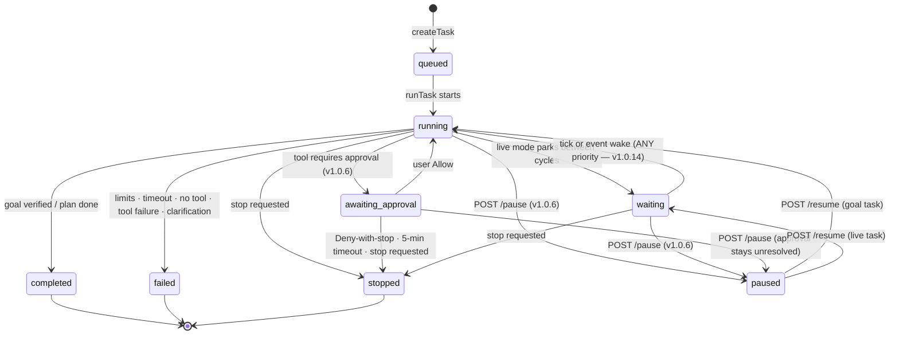

# Runtime — task lifecycle, limits, cancellation

This page is the operational reference for what a task experiences between
`POST /api/tasks` and its terminal state.

## Task lifecycle states

`TaskStatus`: `queued → running → (waiting | awaiting_approval | paused) → completed |
failed | stopped` (`cancelled` exists in the type union for parity; the loop finalizes
user stops as `stopped`). v1.0.6 adds **`awaiting_approval`** (a tool execution is
waiting for a user Allow/Deny decision) and **`paused`** (suspended by the user,
resumable — NOT a terminal state).



Both new states are **active** states: they count toward the active-task totals in
`/api/system`, appear in the console as active tasks, and are rendered distinctly —
`awaiting_approval` amber (warn), `paused` sky-blue (info).

Transitions are persisted immediately (`db.task.update`); the console's Task Preview
polls the detail every 2.5 s while a task is active and merges SSE events on top.

## A task's life in one table

| Phase | What happens | Events |
| --- | --- | --- |
| Created | Row written (`queued`), config clamped, handle registered. | `task.created` (6) |
| Started | Status `running`, tool defs loaded, plan built + stored. | `task.started` (5), `planner.plan_built` (6), `planner.plan` (5) |
| Iterating | CoreModule decides, **approval gate (v1.0.6)**, tools execute (independent steps concurrently in capped parallel batches — v1.0.3), observer interprets, state persists. | `core.decision` (4), `tool.approval.required/allowed/denied` (2–3), `planner.parallel_batch` (5), `planner.partial_failure` (4), `tool.started/completed/…` (4–6), `observer.observed` (6) |
| Awaiting approval (v1.0.6) | Task parked while the user decides on the pending tool. | `tool.approval.required` (2) → `tool.approval.allowed` (3) / `tool.approval.denied` (2) / `tool.approval.timeout` (2) + `tool.execution.blocked` (2) |
| Paused (v1.0.6) | Suspended by the user; state preserved, no new autonomous actions. | `task.paused` (2) → `task.resumed` (3) |
| Waiting (live) | Parked between cycles — event-driven since v1.0.14 (immediate wake, per-cycle deadline, observable `event.*` lifecycle). | `task.waiting` (7), `observer.scheduled_tick` (9), `observer.event_wake` (5), `event.*` lifecycle (5–8) |
| Terminated | `FinalResult` written, status set. | `task.completed` / `task.failed` / `task.cancelled` (3) |

## Limits (resolved from the central configuration; per-task overrides clamped)

v1.0.8 — every limit below (and the clamp ranges) resolves from
`config/configuration-limits.json` (see [Configuration](configuration.md#central-configuration-limits-v108)):
task limits from `task.*`, tool-execution ceilings from `execution.timeoutMs`,
per-request network limits from `network.*` and the virtual command caps from
`childProcess.*`. Editing that one JSON file and restarting changes them everywhere
(Settings, backend validation, runtime enforcement).

| Limit | Default | Hard clamp | Effect when hit |
| --- | --- | --- | --- |
| `maxIterations` | 30 | 1–200 | Goal loop returns `limit_reached` → task `failed`, errorState `SAFETY_LIMIT`. |
| `safetyLimit` (total tool calls) | 100 | 1–500 | Same as above; `maxSubtoolCalls` is also capped by it at creation. |
| `maxSubtoolCalls` | 20 | 1–200 | Caps subtool auto-execution; also a creation-time clamp against `safetyLimit`. |
| `maxParallelToolCalls` (v1.0.3) | 4 | 1–8 | Hard cap on concurrently executing tool calls; overflow runs in later waves. `parallelToolCalls: false` disables batching entirely. |
| `taskTimeoutMs` | 120 000 | 5 000–3 600 000 | Goal loop returns `TIMEOUT` → `failed`. Live Mode uses it as the **per-cycle** deadline for event-driven observation. |
| `toolTimeoutMs` | 30 000 | 1 000–300 000 (executor floor 250 ms) | Single execution → status `timeout`, error code `TIMEOUT`. |
| Request length | — | ≤ 32 000 chars (v1.0.11, raised from 8 000) | Rejected at creation (`TASK_CREATE_FAILED`). |

Checks run at the top of every goal-loop iteration, so a limit breach never lets a task
run more than one extra step.

## Pause and resume (v1.0.6)

`POST /api/tasks/{id}/pause` → `pauseTask`; `POST /api/tasks/{id}/resume` →
`resumeTask`. **Pause ≠ Stop** — stop terminates, pause suspends:

- **What is preserved**: the task row, plan, subgoals, context, Live State (including
  the event queue), and history — everything. Only **new autonomous actions** stop:
  no planner steps, no tool executions, no scheduled-tick cycles.
- **Pause is honored between steps** — the current atomic tool execution always
  finishes first; the loop then parks in `waitWhilePaused` (the task row flips to
  `paused`, a `task.paused` event (priority 2) is emitted).
- **The scheduler holds while paused** — no ticks fire and none are back-filled; on
  resume the live interval **restarts fresh from now** (§11.5: no burst of missed
  ticks).
- **Events during pause are retained** — multi-event mode queues them in the task
  state; single-event mode keeps the first for processing right after resume.
  Nothing is dropped by pausing.
- **Pause during approval** — the approval stays unresolved (never auto-allowed or
  auto-denied); the task shows `paused` while the approval is pending, and the
  5-minute approval timeout remains well-defined.
- **Resume continues from the preserved state** (§11.8) — it never restarts the task.
  A task paused while awaiting approval returns to `awaiting_approval`; a goal task
  returns to `running`, a live task to `waiting` (then processes retained events).
  `task.resumed` (priority 3) is emitted.

Honest limitation: the pause is realized through the in-memory runtime handle. If the
server process dies while a task is paused, the task row stays `paused` in the DB and
**cannot resume** (there is no handle to wake); Stop still works.

```bash
curl -X POST http://localhost:3000/api/tasks/task_1a2b3c4d/pause
curl -X POST http://localhost:3000/api/tasks/task_1a2b3c4d/resume
```

## Cancellation

`POST /api/tasks/{id}/stop` → `stopTask`:

1. `stopFlag.stopped = true` — checked before every iteration, after every wake, and
   before each recovery pass.
2. `abortController.abort()` — the executor races every tool handler against the abort
   signal; the in-flight execution resolves as `cancelled` (code `CANCELLED`) instead of
   leaking.
3. Synthetic `task.stop` wake (priority 1) — a waiting live task exits its wait
   immediately and finalizes `stopped`.
4. `task.stop_requested` event (priority 1) is persisted/streamed.

Final result for a stop: `{ status: 'stopped', result: { summary: <last observation> } }`
with statusDetail `Stopped by user.` (or `Live task stopped by user.`).

## Timeouts and retries

- **Tool-level**: `Promise.race([handler, timeout, abort])`. A timeout produces execution
  status `timeout` with `TIMEOUT`; the observation sentence reflects it.
- **Goal Mode failure handling (v1.0.11)** — a failed/timed-out **pre-plan** step no
  longer costs a single blind retry plus a hard stop: the main plan is FROZEN and the
  bounded recovery state machine runs (recovery subgoal → own pre-plan ≤ 4 steps →
  execute → Observer verify), bounded by `task.recoveryMaxAttempts` (2–4, default 4).
  One-by-one tasks keep their no-blind-retry replan (`planner.one_by_one_replanned`).
  See [Planner → Pre-plan failure recovery](planner.md#pre-plan-failure-recovery-v1011).
- **LLM call budgets**: CoreModule 25 s (plus one stricter re-ask), Planner 25 s,
  Observer verify 6 s, subgoal proposal / feedback revision 10 s each.
- **Live Mode**: no retry machine — failed cycles just log and the next tick tries again;
  the wait loop keeps the task alive until stopped. Environment-driven repair passes are
  unchanged by v1.0.11 recovery (recovery applies to pre-plan goal tasks only).

## Error surface (errorState codes)

| Code | Stage | Meaning |
| --- | --- | --- |
| `SAFETY_LIMIT` | goal_loop | Iteration or tool-call limit reached. |
| `TIMEOUT` | goal_loop | Task-level timeout reached. |
| `CLARIFICATION_REQUIRED` | core_decision | CoreModule reported missing required parameters. |
| `NO_CAPABLE_TOOL` | core_decision | CoreModule returned `cannot_execute`. |
| `NO_TOOL` | core_decision | `no_tool` decision that didn't look informational. |
| `TOOL_FAILURE` | tool_execution | Tool failed after the single retry (legacy path; pre-plan failures now enter recovery first — v1.0.11). |
| `RECOVERY_EXHAUSTED` | recovery | **v1.0.11** — all `recoveryMaxAttempts` (2–4) recovery attempts for a failed pre-plan step failed; the task ends honestly with a statusDetail naming the failed step and the last failure. |
| `RECOVERY_UNRECOVERABLE` | recovery | **v1.0.11** — the Observer judged the failure unrecoverable (`cannot_execute`, a clarification requirement, or an observer verdict); recovery aborts immediately without wasting the retry budget. |
| `RECOVERY_BLOCKED` | recovery | **v1.0.11** — the task was stopped, or an approval timed out, while recovery was executing. |
| `RUNTIME_ERROR` | main | Unexpected exception inside the loop. |
| `RUNTIME_CRASH` | main | Fire-and-forget wrapper caught a crash (task marked `failed`, priority-2 `task.failed`). |

`no_tool` nuance: if the reason matches informational patterns (`no registered tool`,
`not require`, `informational`, …) or confidence ≥ 0.6, the task completes honestly
instead of failing.

## Execution ids and observability

- Task ids: `task_<8 hex>`; execution ids: `exec_<hrtime base36><2 rand bytes>`;
  history-derived ids in the executions endpoint use `hist_<HistoryEntry.id>`.
- Every iteration persists `state` + counters; Task Preview and `/api/tasks/{id}` always
  show the last persisted snapshot, while SSE events fill the gap live.
- Tool stats (call/success/failure/timeout counts, avg ms) accumulate on `ToolRecord`
  rows and surface in `/api/tools` and the Tools view.

## See also

- [Tool Runtime](../tools/tool-runtime.md) — execution mechanics in depth.
- [Scheduler](scheduler.md) — Live Mode wait/wake.
- [Events](events.md) — the full event catalog.
