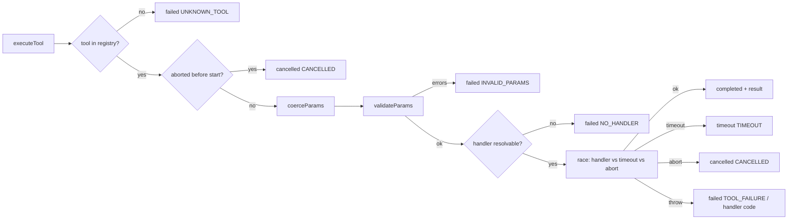

# Tool Runtime

`src/lib/nexool/tools/executor.ts` is the execution engine every tool call passes
through. Its contract: **`executeTool` never throws** — it always resolves with a
structured `ToolExecution`, whether the call succeeded, failed, timed out, or was
cancelled.

```ts
interface ToolExecution {
  executionId: string;   // exec_<hrtime base36><2 rand bytes>
  tool: string;
  status: 'pending' | 'running' | 'completed' | 'failed' | 'timeout' | 'cancelled';
  params?: Record<string, unknown>;   // post-coercion params
  result?: unknown;
  error?: { code: string; message: string } | null;
  startedAt: string;                  // ISO
  completedAt?: string;
  durationMs?: number;
  batchId?: string;                   // v1.0.3: set when this call ran in a parallel batch
  parallelGroup?: number;             // v1.0.3: planner group the call belonged to
}
```

## Execution pipeline



1. **Timeout budget** — `opts.timeoutMs ?? 30_000`, hard-clamped to **250 ms –
   300 000 ms** regardless of config.
2. **Param coercion** (`coerceParams`) — per declared type: numbers from numeric
   strings, `"true"/"false"` → boolean, JSON strings parsed for object/array, CSV
   strings split into arrays. Unknown keys are dropped here.
3. **Validation** (`validateParams`) — after coercion: unknown params are errors,
   required params must exist, types must match (finite numbers, plain objects,
   arrays), `min`/`max` bounds and `enumValues` membership enforced. Errors join into
   one `INVALID_PARAMS` message.
4. **Race** — the handler runs against both the timeout timer (unref'd) and the
   task's `AbortSignal`, so a task stop cancels in-flight work deterministically.
5. **Handler errors** — handlers throw `ToolFailure(message, code)`; the executor maps
   them onto `failed` with the handler's code (`TOOL_FAILURE` default,
   `INVALID_PARAMS`, `SERVICE_UNAVAILABLE`, `INVALID_CONFIG`, …). A timeout message
   detection flips the status to `timeout` with code `TIMEOUT`.
6. **Sandbox invocation hardening (v1.0.5)** — `js-function` and `nodejs` tools are
   invoked *inside* the `node:vm` context under the 4 s sync timeout, so a body
   without `await` (a runaway `for(;;)` loop) is bounded by the vm timeout instead of
   hanging the host event loop until the async 10 s cap.

## Parallel independent calls (v1.0.3)

Two layers of parallelism:

- **Plan groups → `executeParallelBatch`** — when `parallelToolCalls` is on (default)
  and `autoExecuteSubtools` allows execution, the goal loop collects ≥ 2 consecutive
  pending *action* steps sharing a `parallelGroup`, gets one CoreModule decision per
  step, and — only if **every** decision is a `tool_call` — executes the batch through
  `executeParallelBatch(batchId, calls, { maxParallel, ... })`. Otherwise the group is
  reset to pending and handled sequentially.
- **Executor helper** — `executeToolsParallel(calls, opts)` still exists and runs any
  list of calls through `Promise.all` (each call fully independent: own id, own timeout,
  own events/history).

### `executeParallelBatch` semantics

- **Hard concurrency cap** — `maxParallel` is clamped to **1–8** (default 4). There is
  no unlimited concurrency, ever.
- **Waves** — the goal loop slices the group to the cap before dispatch
  (`group.slice(0, min(group.length, maxParallelToolCalls))`), so a larger same-group
  backlog runs across later loop iterations instead of one oversized dispatch.
  `executeParallelBatch` itself also clamps the cap and would run any calls beyond it in
  subsequent waves after the current wave completes — overflow is deferred, never
  widened.
- **Failure isolation** — `executeTool` never throws, and each call is independent:
  one sibling failing (or timing out) never cancels the others. If some but not all
  calls of a batch fail, the loop marks the steps individually and emits
  `planner.partial_failure`; the survivors count.
- **Per-call safety unchanged** — `toolTimeoutMs` still applies to every call in the
  batch, and the task's abort signal still cancels in-flight calls.
- **Safety limits unchanged** — `safetyLimit`/`maxSubtoolCalls` accounting is not
  relaxed by batching; every call still counts.
- **Provenance** — every batched call gets `batchId` + `parallelGroup` on the execution,
  a `tool.started` message with a `(parallel batch)` suffix, and the fields persisted on
  its `HistoryEntry` row (new v1.0.3 columns) — which is what
  `GET /api/tasks/{id}/executions` returns and what Task Preview groups into a labeled
  "parallel batch · N concurrent" card.

Dependent operations are simply steps **without** a shared group — the loop executes
them sequentially in plan order, so step N+1 can use step N's observation as context.
There is no automatic dataflow between executions; dependencies are expressed through
plan order and the context bundle.

## The nodejs execution environment (v1.0.5)

`environment: 'nodejs'` tools run in `src/lib/nexool/tools/node-runner.ts` — a
restricted Node.js JavaScript environment with the same `execute(params, context)`
contract and the same structured-result shape as the `js-function` runner
(`js-runner.ts`), so the executor, `POST /api/tools/test` and the CLI share one path
per environment:

- **Allowlisted modules only** — `require()`/`await import()` resolve through
  `NODE_MODULE_ALLOWLIST` (`buffer`, `crypto`, `events`, `path`, `querystring`,
  `string_decoder`, `url`, `util`, `assert`, `zlib`). Anything else fails with
  `Module "x" is not available in the NexTool Node.js environment.` — deliberately
  blocked modules (`child_process`, `cluster`, `vm`, `worker_threads`, `fs`, `os`,
  `net`, `dgram`, `http`, `https`, `process`) append their reason.
- **Dynamic `import()` without host flags** — `import("x")` call sites are rewritten
  at compile time to an allowlist shim (`__nexoolDynamicImport`) with the same
  allowlist as `require()`, because the stock `vm` dynamic-import callback would need
  `--experimental-vm-modules`.
- **No `process`, no timers, no `fetch`** — the sandbox globals are exactly
  `params`, `context`, a capped `console` (100 lines × 2000 chars), `Buffer`,
  `TextEncoder`, `TextDecoder`, `URL`, `URLSearchParams`, `atob`/`btoa` and
  `structuredClone`.
- **Execution limits** — source ≤ 64 000 chars; sync cap 4 s enforced at the function
  invocation (bounds no-`await` runaway loops without freezing the host event loop);
  async watchdog 10 s (`TIMEOUT`); heap-growth sentinel 256 MiB (`MEMORY` — an honest
  in-process guard: it aborts the tool result but cannot revoke memory already
  allocated in the host realm); result ≤ 64 KiB serialized, depth ≤ 12.
- The authoring-side contract (allowlist table, globals, error wording) is documented
  in [Tool Development](tool-development.md#the-nodejs-environment--restricted-nodejs-v105).

## Runtime capability source: GET /api/tools/environments (v1.0.5)

The handler-kind registry (`HANDLER_KIND_INFO` in `tools/registry.ts`) and the
Node.js configuration (`NODE_MODULE_ALLOWLIST`, `NODE_BLOCKED_MODULES`,
`NODE_SANDBOX_GLOBALS`, `NODE_EXECUTION_LIMITS` in `tools/node-runner.ts`) are served
verbatim by `GET /api/tools/environments` — environments, handler kinds with their
`configFields`, sandbox limits and the module allowlist/globals. The Tool IDE
selector, handler-kind UI, IntelliSense declarations and References panel read THIS
endpoint; there is no hardcoded frontend copy of the runtime capabilities.

The `http_get` handler kind's structured config — `url` (required) and `timeout`
(ms, 1000–15000, default 8000) — is declared in the same registry
(`configFields`) and enforced by the handler at execution time.

## Failure, cancel and retry semantics

| Outcome | Execution status | Error code | Event | Retry? |
| --- | --- | --- | --- | --- |
| Unknown tool | failed | `UNKNOWN_TOOL` | `tool.failed` (5) | No |
| Invalid params | failed | `INVALID_PARAMS` | `tool.failed` (5) | No |
| No handler bound | failed | `NO_HANDLER` | `tool.failed` (5) | No |
| Handler threw | failed | handler code | `tool.failed` (5) | **Once** in Goal Mode (fresh decision with the error as observation; `planner.retry` event). Second failure ends the task (`TOOL_FAILURE`). |
| Timeout | timeout | `TIMEOUT` | `tool.timeout` (4) | Same single retry rule. |
| Task stop / abort | cancelled | `CANCELLED` | `tool.cancelled` (5) | No — stop wins. |

In Live Mode there is no retry machinery: failed cycles are logged and the next tick or
event wake tries again.

## After every execution (finalize)

- **Stats** — `completed | failed | timeout` increment the tool's counters and
  cumulative ms on `ToolRecord` (durable, per-tool, surfaced in `/api/tools`).
- **Event** — `tool.completed` / `tool.failed` / `tool.timeout` / `tool.cancelled` with
  the full execution as payload; the execution id lets you correlate
  `tool.started` ↔ terminal event.
- **History** — a `HistoryEntry` row (task, action, params JSON, result JSON, status,
  and — v1.0.3 — `batchId`/`parallelGroup` for batched calls).
  This is the durable record the console's History view and the task's
  `/executions` endpoint read; it survives restarts and is written even when other
  bookkeeping fails (write failures are logged, never thrown).

## Execution ids

- Live executions: `exec_<high-resolution time base36><2 hex bytes>` — unique per call,
  present in both the `tool.started` and terminal event payloads.
- History-derived records (the `/api/tasks/{id}/executions` endpoint reconstructs
  executions from history rows): ids look like `hist_<HistoryEntry.id>`; error fields
  for those are reconstructed (`{ code: 'FAILED' | 'TIMEOUT', message: 'See task
  events for details.' }`) since history rows don't store structured errors.

## Notes and edges

- `params` recorded on the execution are the **coerced** values — what the handler
  actually received.
- A `tool_call` decision whose tool got disabled mid-task is caught earlier by the
  CoreModule gate (→ `cannot_execute`), but the executor would still answer
  `UNKNOWN_TOOL`/`NO_HANDLER` as defense in depth.
- Cancellation before start is possible: if the abort signal fires between decision and
  execution, the execution resolves `cancelled` without invoking the handler.

## See also

- [Tools](tools.md) — definitions, registration, handler kinds.
- [Tool Development](tool-development.md) — the Tool IDE and both function-tool sandboxes.
- [Runtime](../architecture/runtime.md) — task-level limits and cancellation.
- [Events](../architecture/events.md) — tool event catalog.
