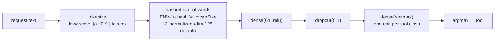
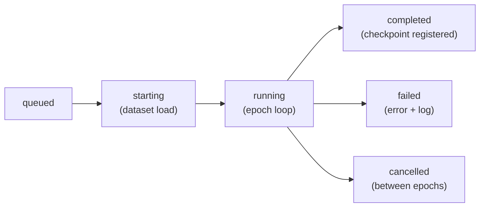

# Training

v1.0.2 ships a **real TensorFlow.js training engine**
(`src/lib/nexool/training/engine.ts`). It trains a tool-selection classifier on an
imported dataset: requests in, `expectedTool` labels out, weights persisted as a genuine
TF.js checkpoint in the model registry. Every metric the engine reports comes from an
actual `model.fit` run — nothing is synthesized. The Web Console (Training view +
`/api/training`) and the CLI (`nextool train`) call the same module.

## What is trained

A small dense classifier over a hashed bag-of-words representation of the request text:



- Compilation: Adam optimizer (`learningRate`), `categoricalCrossentropy` loss,
  `accuracy` metric.
- Vectorization is deterministic (FNV-1a string hash) — the same request always yields
  the same vector, on the CPU backend in Node.
- The class table is the sorted set of distinct `expectedTool` values across the selected
  examples.

## Dataset requirements

| Requirement | Behavior when unmet |
| --- | --- |
| ≥ 4 labeled examples (after split selection) | Job **fails** with a readable error naming the counts. |
| ≥ 2 distinct tools (classes) | Job **fails** likewise. |
| Examples without `expectedTool` | Skipped and counted; a `warn` log line records how many. |

**Split selection:** explicit `train`/`validation` splits are used when present
(examples without a split join `train`). If the dataset has *no* explicit splits at all,
a deterministic validation holdout is carved by `validationSplit` (shuffle is seeded by
the request hash, so re-runs split identically). With no validation examples, `fit` runs
without `validationData` and `valLoss`/`valAccuracy` are `null` — honestly reported as
such. See [Datasets](datasets.md) for the import format.

## Configuration

Values outside the ranges are clamped (HTTP) / resolved identically (CLI).

| Field | Range | Default | Meaning |
| --- | --- | --- | --- |
| `epochs` | 1–100 | 20 | Training passes over the dataset. |
| `batchSize` | 1–128 | 8 | Batch size for `model.fit`. |
| `learningRate` | 0.0001–1 | 0.01 | Adam learning rate. |
| `validationSplit` | 0–0.5 | 0.2 | Holdout fraction when carving a validation set (only for datasets without explicit splits). |
| `shuffle` | boolean | true | Shuffle training data between epochs. |
| `vocabSize` | 16–1024 | 128 | Hashed bag-of-words dimension (the model's input shape). |
| `earlyStoppingPatience` | 0–50 | 0 (off) | Stops when `val_loss` stops improving; best weights are restored (`restoreBestWeights`). Requires a validation holdout. |

## Job lifecycle

Statuses: `queued → starting → running → completed | failed | cancelled`.



- **POST /api/training** (or `nextool train`) creates the `TrainingJobRecord` and starts
  the runner. The HTTP path is fire-and-forget (202) — the console polls
  `GET /api/training/{id}`; the CLI runs the same job in the foreground.
- **Progress is persisted per epoch**: `{ at, epoch, loss, valLoss, accuracy,
  valAccuracy, elapsedMs }` rows in `metrics`, and log lines `{ at, level, message }` in
  `logs` (capped at 400 entries). Log events: dataset loaded, skipped-example warning,
  preprocessing, model initialized, training started, epoch progress, early stopping
  enabled, checkpoint saved, completed/failed.
- **Cancellation:** `DELETE /api/training/{id}` on an active job flips the status to
  `cancelled`; the runner checks between epochs and stops, discarding the partial model.
  **Pause is NOT supported** — there is no pause state, no pause endpoint and no pause
  button; this is a deliberate, honest limitation of v1.0.2.
- A failed job keeps its error message and logs for inspection; nothing is registered.

## The trained model package

On completion the engine serializes the model through a TF.js save handler and creates a
real `ModelRecord` row:

| Manifest field | Content |
| --- | --- |
| `name` / `version` | `tool-classifier-<dataset-name>` / `tc-<job-id-derived>` |
| `format` | `tfjs-trained-classifier` |
| `modelTopology` + `weightSpecs` + `weightData` | Native TF.js artifacts (weights base64-encoded) |
| `classes` | Sorted tool-class list (index → tool mapping used at inference) |
| `vocabSize` | Vectorizer dimension the weights were trained with |
| `trainingConfig` | The resolved config actually used |
| `finalMetrics` | `{ loss, valLoss, accuracy, valAccuracy, trainMs }` |
| `datasetId/Name/Version` | Dataset lineage |
| `tfjsCompatibility` | TF.js version that produced the topology |
| `parameterCount` | Sum of weight-shape products |

The checkpoint is `status: registered` and immediately usable: benchmark it
(`-m <modelId>`, see [Benchmarks](benchmarks.md)) and export it
(see [Model Format](model-format.md)).

**What a trained classifier is NOT:** it is a tool *selector* only. It outputs a class
(tool name) + confidence; it does **not** generate parameters (`paramAccuracy` is `null`
when benchmarking it), plan, observe or verify goals. It does not replace llm-core as
the active engine — the runtime's decision unit is unchanged (llm-core 1.0.0).

## Workflows

### Console

**Training** view → pick dataset → adjust config (epochs / batch / learning rate /
validation split / vocab / early stopping) → **Start training**. The job list shows live
status, `epochsDone/epochs`, and the metrics table grows per epoch; the log pane streams
the persisted log lines. Delete/cancel via the job row (running jobs cancel, finished
jobs are removed from history).

### CLI

```bash
nextool train -d tool-selection -e 20 --early-stop 5
```

prints the dataset/config header, the job log, then the final line with the registered
model id and metrics (see [CLI](../operations/cli.md#train--train-a-tool-selection-classifier)).

## Honest limitations

- CPU/pure-JS TF.js backend in Node — training small classifiers, not deep networks;
  no WebGL/WebGPU acceleration.
- No pause/resume; cancellation only takes effect between epochs.
- `valLoss`/`valAccuracy` are `null` without a validation holdout (reported as such, not
  fabricated).
- Log history is capped at 400 lines per job; metrics are kept in full.
- Feedback memory (`feedback_<taskId>` entries) remains a runtime-learning mechanism and
  is **not** training data for this engine — only imported datasets are consumed.
