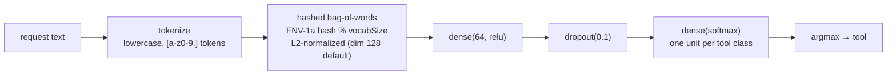
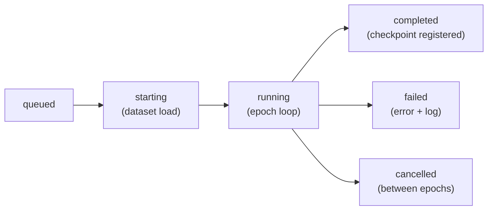

# Training

v1.0.2 ships a **real TensorFlow.js training engine**
(`src/lib/nexool/training/engine.ts`). It trains a tool-selection classifier on an
imported dataset: requests in, `expectedTool` labels out, weights persisted as a genuine
TF.js checkpoint in the model registry. Every metric the engine reports comes from an
actual `model.fit` run — nothing is synthesized. The Web Console (Training view +
`/api/training`) and the CLI (`nextool train`) call the same module.

## What is trained

A small dense classifier over a hashed bag-of-words representation of the request text:



- Compilation: Adam optimizer (`learningRate`), `categoricalCrossentropy` loss,
  `accuracy` metric.
- Vectorization is deterministic (FNV-1a string hash) — the same request always yields
  the same vector, on the CPU backend in Node.
- The class table is the sorted set of distinct `expectedTool` values across the selected
  examples.

## Dataset requirements

| Requirement | Behavior when unmet |
| --- | --- |
| ≥ 4 labeled examples (after split selection) | Job **fails** with a readable error naming the counts. |
| ≥ 2 distinct tools (classes) | Job **fails** likewise. |
| Examples without `expectedTool` | Skipped and counted; a `warn` log line records how many. |

**Split selection:** explicit `train`/`validation` splits are used when present
(examples without a split join `train`). If the dataset has *no* explicit splits at all,
a deterministic validation holdout is carved by `validationSplit` (shuffle is seeded by
the request hash, so re-runs split identically). With no validation examples, `fit` runs
without `validationData` and `valLoss`/`valAccuracy` are `null` — honestly reported as
such. See [Datasets](datasets.md) for the import format.

## Configuration

Values outside the ranges are clamped (HTTP) / resolved identically (CLI).

| Field | Range | Default | Meaning |
| --- | --- | --- | --- |
| `epochs` | 1–100 | 20 | Training passes over the dataset. |
| `batchSize` | 1–128 | 8 | Batch size for `model.fit`. |
| `learningRate` | 0.0001–1 | 0.01 | Adam learning rate. |
| `validationSplit` | 0–0.5 | 0.2 | Holdout fraction when carving a validation set (only for datasets without explicit splits). |
| `shuffle` | boolean | true | Shuffle training data between epochs. |
| `vocabSize` | 16–1024 | 128 | Hashed bag-of-words dimension (the model's input shape). |
| `earlyStoppingPatience` | 0–50 | 0 (off) | **v1.0.10 — MANUAL early stopping** (see below): stops when `val_loss` has not improved for `patience` epochs and restores the best weights. Implemented in the epoch callback because the tf.js `EarlyStopping` callback is broken in this build. Requires a validation holdout. |
| `modelVersion` | semver-like string (`/^\d+\.\d+\.\d+/` prefix check) | `TRAINED_MODEL_VERSION` (`'1.0.5'` since v1.0.16; was `'1.0.4'` in v1.0.15, `'1.0.3'` in v1.0.12) | **v1.0.10**: optional semantic version the checkpoint registers under. Legacy `checkpointId`s keep the `tc-<job>` identifier for traceability; old checkpoints keep their original versions. |

## Job lifecycle

Statuses: `queued → starting → running → completed | failed | cancelled`.



- **POST /api/training** (or `nextool train`) creates the `TrainingJobRecord` and starts
  the runner. The HTTP path is fire-and-forget (202) — the console polls
  `GET /api/training/{id}`; the CLI runs the same job in the foreground.
- **Progress is persisted per epoch**: `{ at, epoch, loss, valLoss, accuracy,
  valAccuracy, elapsedMs }` rows in `metrics`, and log lines `{ at, level, message }` in
  `logs` (capped at 400 entries). Log events: dataset loaded, skipped-example warning,
  preprocessing, model initialized, training started, epoch progress, early stopping
  enabled, checkpoint saved, completed/failed.
- **Cancellation:** `DELETE /api/training/{id}` on an active job flips the status to
  `cancelled`; the runner checks between epochs and stops, discarding the partial model.
  **Pause is NOT supported** — there is no pause state, no pause endpoint and no pause
  button; this is a deliberate, honest limitation of v1.0.2.
- A failed job keeps its error message and logs for inspection; nothing is registered.

## The trained model package

On completion the engine serializes the model through a TF.js save handler and creates a
real `ModelRecord` row:

| Manifest field | Content |
| --- | --- |
| `name` / `version` | `tool-classifier-<dataset-name>` / the resolved model version (v1.0.10: `modelVersion` config → default `TRAINED_MODEL_VERSION` — `'1.0.5'` since v1.0.16, was `'1.0.4'` in v1.0.15; the legacy `tc-<job-id-derived>` identifier remains as `checkpointId` for traceability) |
| `format` | `tfjs-trained-classifier` |
| `modelTopology` + `weightSpecs` + `weightData` | Native TF.js artifacts (weights base64-encoded) — v1.0.10: the weights snapshotted at the **best validation-accuracy epoch** (checkpoint selection) when a validation holdout exists |
| `checkpointSelection` | **v1.0.10** — `{ selectedEpoch, valAccuracy, strategy: 'best-validation-accuracy' }` (or `strategy: 'final-epoch (no validation holdout)'`) |
| `modelSemanticVersion` | **v1.0.10** — the semantic model generation of the checkpoint (`'1.0.5'` by default since v1.0.16; was `'1.0.4'` in v1.0.15) |
| `classes` | Sorted tool-class list (index → tool mapping used at inference) |
| `vocabSize` | Vectorizer dimension the weights were trained with |
| `trainingConfig` | The resolved config actually used (incl. `modelVersion` since v1.0.10) |
| `finalMetrics` | `{ loss, valLoss, accuracy, valAccuracy, trainMs }` |
| `datasetId/Name/Version` | Dataset lineage |
| `tfjsCompatibility` | TF.js version that produced the topology |
| `parameterCount` | Sum of weight-shape products |

The checkpoint is `status: registered` and immediately usable: benchmark it
(`-m <modelId>`, see [Benchmarks](benchmarks.md)) and export it
(see [Model Format](model-format.md)).

**What a trained classifier is NOT:** it is a tool *selector* only. It outputs a class
(tool name) + confidence; it does **not** generate parameters (`paramAccuracy` is `null`
when benchmarking it), plan, observe or verify goals. It does not replace llm-core as
the active engine — the runtime's decision unit is unchanged (llm-core 1.0.0).

## v1.0.10 — training engine upgrade (model version 1.0.1)

The engine (`src/lib/nexool/training/engine.ts`) gained four real upgrades, each fixing
or completing something verified broken/missing in earlier releases:

1. **Checkpoint selection** — the engine tracks the best validation accuracy per epoch
   and snapshots those weights; they are **restored before saving**, so the registered
   checkpoint is the best-epoch model rather than whatever the LAST epoch happened to
   produce. The strategy is recorded in the manifest as `checkpointSelection`
   (`{ selectedEpoch, valAccuracy, strategy }`).
2. **Manual early stopping on `val_loss`** — the tf.js `EarlyStopping` callback is
   broken in this build (`restoreBestWeights = True is not implemented`,
   `this.getMonitorValue is not a function`), so early stopping is implemented in the
   epoch callback itself: after `earlyStoppingPatience` epochs without `val_loss`
   improvement the loop stops and the best weights are restored. Behavior is identical
   to the documented contract; the crash is gone.
3. **Unique per-job model/layer names + dispose-on-failure** — a previously FAILED job
   leaked TF.js variables (`Variable with name dense_Dense1/kernel was already
   registered`) that poisoned every LATER job in the same process. Each job now builds
   its model with unique names and disposes every tensor on failure — a failed job can
   no longer break the next one (restart also clears leaked variables).
4. **`modelVersion` in `trainingConfig`** (optional, semver-validated) — the checkpoint
   registers under this semantic version. The default resolves to
   `TRAINED_MODEL_VERSION` from `version.ts` — **`'1.0.1'` in this release** — while
   `manifest.checkpointId` keeps the legacy `tc-<job>` identifier for traceability.
   Checkpoints trained before v1.0.10 keep their original versions; nothing is
   re-versioned in place.

The **shipped seed dataset for this generation** is
`config/training/seed-dataset-v1.0.1.json` ("NexTool Core v1.0.1 Seed", version 1.0.1):
**170 examples — 121 train / 23 validation / 26 test**; all 15 registered tools covered
in train AND test; paraphrases, synonyms, typos, ambiguous/confusing pairs,
conversational wording; parameter-generation examples (`expectedParams` inside real tool
schemas); zero duplicate requests (no split leakage). See [Datasets](datasets.md).
Benchmarked against the held-out test split in this release (see
[Benchmarks](benchmarks.md)): the v1.0.1 classifier reaches **0.6923** tool-selection
accuracy vs **0.4231** for the old 1.0.0-era checkpoint on identical data.

## v1.0.11 — training upgrade (model + dataset 1.0.2)

The generation 1.0.2 pairs the expanded seed dataset with a wider vectorizer and a
measured, honest retrain loop:

- **Dataset 1.0.2** — `config/training/seed-dataset-v1.0.2.json` ("NexTool Core
  v1.0.2 Seed"): **324 examples — 246 train / 39 validation / 39 test**, 17
  categories, all 15 tools in ALL three splits, zero duplicate requests, expectedParams
  inside real schemas. NEW vs 1.0.1: long Markdown-heavy documents (runbooks,
  maintenance packs), hard examples (typos, synonyms, ambiguity, confusion pairs,
  irrelevant context, failed previous attempts, state-after-action, conditional
  requirements) and pattern-aware recovery/verification/state-transition examples.
  Generated deterministically by `scripts/gen-seed-dataset-v102.py`; the
  **test/validation splits are FROZEN by request text** so improvements are measurable
  on identical held-out data. See [Datasets](datasets.md).
- **Training run (model 1.0.2 = dataset 1.0.2)** — `vocabSize` **512** (up from 128),
  manual early stop @ **20/50** epochs, checkpoint selection restored the best
  validation-accuracy epoch (**val_accuracy 0.7692**), ~8 s train on the CPU backend.
- **Error analysis story (§56, recorded honestly)** — the FIRST 1.0.2 run (still
  `vocabSize` 128) scored **0.5385** tool-selection accuracy on the frozen test split —
  a REGRESSION vs the recorded 1.0.1 number. The failures were categorized (hash
  collision/dilution among time/echo/delay/image classes) and fixed with the wider
  `vocabSize` 512 plus **61 targeted train-only examples** for the weak classes. The
  test/validation splits stayed FROZEN throughout, so the final retrain's improvement
  is measured on exactly the same held-out data. Remaining failures are documented
  (11 of 39: long-doc health objective, typos, low-confidence confusions) — the
  classifier is better, not perfect.
- **Benchmark result** — trained 1.0.2 = **0.7179** vs trained 1.0.1 = **0.5641** and
  heuristic-fallback = 0.5641 on the identical frozen 39-case split (llm-core 0.8205);
  full table in [Benchmarks](benchmarks.md#v1011-release-benchmark-recorded-history).
- **Inference latency optimization (§50)** — the ZAI client is now cached process-wide
  (ONE init per process, failed init retries), shared across CoreModule decisions,
  Observer verifications, recovery assessments and planner proposals; the system prompt
  is memoized instead of being rebuilt per call. The llm-core decision latency in the
  benchmark is UNCHANGED (~1120 ms — dominated by the provider round-trip); the
  optimization removes per-call init overhead. llm-core itself is NOT retrained and
  stays version 1.0.0.
- **Long-input support (§45)** — the task request cap rose **8 000 → 32 000 chars**
  (`createTaskSchema`) and the dataset-example request cap likewise
  **8 000 → 32 000** (`datasetExampleSchema`) — large Markdown task descriptions are no
  longer truncated.
- `tests/nextool-v1011.test.ts` guards the dataset integrity, the training config and
  the benchmark constants (see [Testing](testing.md)).

## Pattern learning (v1.0.10 — additional evidence, not training)

Alongside training, the runtime now maintains a deterministic **pattern store**
(`src/lib/nexool/patterns/extractor.ts`, persisted as Prisma `PatternRecord` rows,
hooked fire-and-forget in `loop.ts` `recordExecution` + finalize):

```text
Tool Result → Observer (interpret) → Pattern Extraction (deterministic, no LLM)
           → Pattern Store (Prisma PatternRecord) → optional Training Dataset
```

- **Pattern types**: `sequence` (A→B successful transitions), `verification` (any
  action → `server.health`), `outcome` (unhealthy-detected→restart; restart→verified-
  healthy), `failure-recovery` (A failed → B succeeded), `live` (one-by-one live
  transitions), `early-completion` (task completed with ≤ 1 step / unused planned steps
  discarded).
- **Confidence is DERIVED, never observed**:
  `successRate × min(1, total/3) − 0.15 × contradictions` (floor 0). ONE observation →
  ≤ 0.333 (never high confidence); repetitions strengthen (verified: a repeated pattern
  strengthened 0.333 → 0.667 at frequency 2; one-off patterns stayed at 0.333);
  contradictions weaken.
- **Read access**: `GET /api/patterns` (list + stats, `?type=`, `?minConfidence=`) and
  `?format=examples&minConfidence=0.5` — converts reliable single-action patterns
  (`early-completion:<tool>`, `outcome:unhealthy-detected->restart`) into
  pattern-learned training examples; multi-tool transitions are deliberately NOT
  converted (see [API](../api/api.md#get-apipatterns-v1010)).
- **Status**: pattern information is **ADDITIONAL EVIDENCE** — it never becomes a
  mandatory runtime dependency, and inference works unchanged with an empty store.

## Workflows

### Console

**Training** view → pick dataset → adjust config (epochs / batch / learning rate /
validation split / vocab / early stopping) → **Start training**. The job list shows live
status, `epochsDone/epochs`, and the metrics table grows per epoch; the log pane streams
the persisted log lines. Delete/cancel via the job row (running jobs cancel, finished
jobs are removed from history).

### CLI

```bash
nextool train -d tool-selection -e 20 --early-stop 5
```

prints the dataset/config header, the job log, then the final line with the registered
model id and metrics (see [CLI](../operations/cli.md#train--train-a-tool-selection-classifier)).

## Honest limitations

- CPU/pure-JS TF.js backend in Node — training small classifiers, not deep networks;
  no WebGL/WebGPU acceleration.
- No pause/resume; cancellation only takes effect between epochs.
- `valLoss`/`valAccuracy` are `null` without a validation holdout (reported as such, not
  fabricated).
- Log history is capped at 400 lines per job; metrics are kept in full.
- Feedback memory (`feedback_<taskId>` entries) remains a runtime-learning mechanism and
  is **not** training data for this engine — only imported datasets are consumed.


## v1.0.15 — the v1.0.4 training release (THE LEARNED MIND)

- **Curriculum**: `config/training/seed-dataset-v1.0.4.json` (851 examples, 46
  categories) — the full v1.0.3 curriculum plus every v1.0.15 knowledge domain
  (coding, error understanding, GK, 14 coding languages, creative/AskSelf,
  complex content, patterns, self-understanding, PCB/electronics/electricity,
  software/computer engineering, design, intelligent improvement, tool
  title+body+environment, AskSelf/AskForUser, user events, approval states,
  terminal environments, planner/recovery, JSON). All 33 registered tools now
  appear in every split (v1.0.3 only covered 25 — fs.find/copy/move/cmd/
  download/upload and ask.user were added in v1.0.13/v1.0.14 and had never
  been trained).
- **Featurization**: hashed bag-of-words + ADJACENT-TOKEN BIGRAMS
  (L2-normalized). One `vectorize()` implementation is shared by training and
  every inference path — train/serve can never drift.
- **Capacity**: `hiddenUnits` (8-512, default 64) in `TrainingConfig`; CLI
  flags `--vocab` / `--hidden-units` / `--model-version`.
- **§53 improvement loop (measured)**: 54% → 51% (harder split) → 57%
  (bigrams) → 59% (vocab 1024) → 58% (hidden 128, best val 0.6628 — selected
  as canonical by best-val-accuracy checkpointing). Every pass persisted in
  the benchmark run history.
- **Canonical v1.0.4 checkpoint**: 135,457 parameters, 33 classes, vocab 1024,
  trained with batch 16 / lr 0.004 / early stop 12. Exported to
  `model-checkpoints/v1.0.4/` (`model.zip` + `model.nextool`) by
  `bun scripts/release-checkpoint-v104.ts` and validated by real load +
  real inference (see [Release 1.0.15](release-1.0.15.md)).
- **Current-model registry**: `training/current-model.ts` — training
  completion AUTO-MARKS the fresh checkpoint CURRENT; the runtime classifier
  feeds a hint into every CoreModule decision and is the first fallback when
  the LLM is unavailable.
